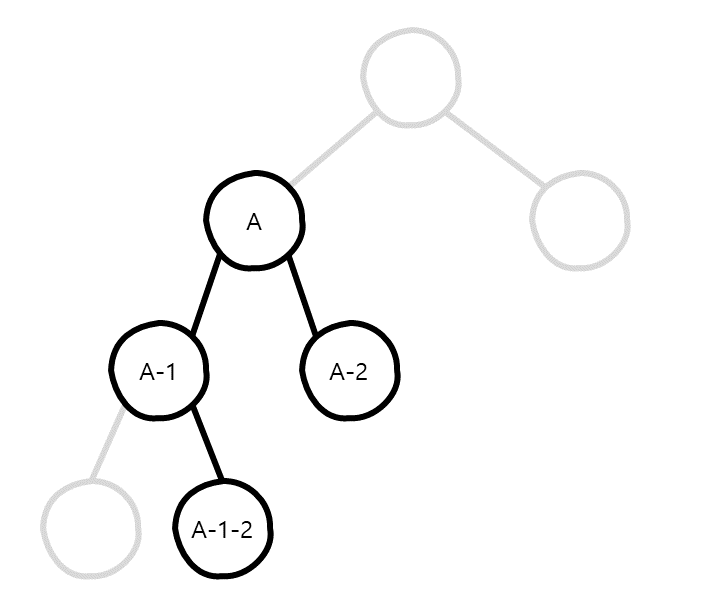

# 문제
## [#98. Validate Binary Search Tree](https://leetcode.com/problems/validate-binary-search-tree)
Given the root of a binary tree, determine if it is a valid binary search tree (BST).  
A **valid BST** is defined as follows:
* The left subtree of a node contains only nodes with keys **less than** the node's key.
* The right subtree of a node contains only nodes with keys **greater than** the node's key.
* Both the left and right subtrees must also be binary search trees.

## Example 1.
```
Input: root = [2,1,3]
Output: true
```

## Example 2.
```
Input: root = [5,1,4,null,null,3,6]
Output: false
Explanation: The root node's value is 5 but its right child's value is 4.
```

## Constraints.
```
The number of nodes in the tree is in the range [1, 104].
-2^31 <= Node.val <= 2^31 - 1
```

---

# 해법
특정 노드 (A)를 기준으로 왼쪽 자식노드 (A-1)는 부모노드 (A)보다 값이 작아야 하며, 오른쪽 자식노드 (A-2)는 부모노드 (A)보다 값이 커야 합니다.  
뿐만 아니라, 왼쪽 자식노드 (A-1)의 오른쪽 자식노드 (A-1-2)는 부모노드 (A-1)보다는 커야하며,
조상노드 (A)보다는 작아야 하는 조건을 만족해야 한다는 부분이 중요합니다.



## 나의 해법 (Recursion)
### 성능
- 시간 복잡도 : `O(n)`
- 공간 복잡도 : `O(n)`

### 해법
재귀 호출을 통한 후위 순회(Inorder)를 이용한 해법으로, `root` 노드로부터 시작하여 노드의 값이 유효한지 체크하고, 유효하다면 재귀 호출을 통해 자식노드를 확인한다.
1. `root` 노드부터 `isValidBST()` 함수를 호출한다.  
   최소 한계값 및 최대 한계값은 없으므로 null을 입력한다.
2. `isValidBST()` 함수 내에서 입력받은 `node`의 값이 null이면 true를 반환한다.
3. 최소 한계값인 `minLimit`이 존재한다면, `node`의 값이 **최소 한계값**보다 **작거나 같다**면 false를 반환한다.
4. 최대 한계값인 `maxLimit`이 존재한다면, `node`의 값이 **최대 한계값**보다 **크거나 같다**면 false를 반환한다. 
5. 왼쪽 자식노드가 유효한지 확인한다.  
5-1. `isValidBST()` 함수를 재귀 호출하며, 인자로 왼쪽 자식노드 `node.left`, 최소 한계값 `minLimit` 그리고 최대 한계값으로 현재 노드의 값 `node.val`을 전달한다.  
     (왼쪽 자식노드는 부모 노드보다 작아야 하기 때문에 최대 한계값으로 현재 노드의 값을 전달한다.)  
5-2. 왼쪽 자식노드가 유효하지 않다면 false를 반환한다.
6. 오른쪽 자식노드가 유효한지 확인한다.  
6-1. `isValidBST()` 함수를 재귀 호출하며, 인자로 오른쪽 자식노드 `node.right`, 최소 한계값으로 현재 노드의 값 `node.val` 그리고 최대 한계값 `maxLimit`을 전달한다.  
     (오른쪽 자식노드는 부모 노드보다 커야 하기 때문에 최소 한계값으로 현재 노드의 값을 전달한다.)  
6-2. 오른쪽 자식노드가 유효하지 않다면 false를 반환한다.
7. 최종적으로 모든 노드가 유효하다면 true를 반환한다.

### Java 코드
```java
/**
 * Definition for a binary tree node.
 * public class TreeNode {
 *     int val;
 *     TreeNode left;
 *     TreeNode right;
 *     TreeNode() {}
 *     TreeNode(int val) { this.val = val; }
 *     TreeNode(int val, TreeNode left, TreeNode right) {
 *         this.val = val;
 *         this.left = left;
 *         this.right = right;
 *     }
 * }
 */
public class ValidateBinarySearchTree {

  public boolean isValidBST(TreeNode root) {
    return isValidBST(root, null, null);
  }

  public boolean isValidBST(TreeNode node, Integer minLimit, Integer maxLimit) {
    if (node == null) return true;

    if (minLimit != null && node.val <= minLimit) return false;
    if (maxLimit != null && node.val >= maxLimit) return false;

    if (!isValidBST(node.left, minLimit, node.val)) return false;
    if (!isValidBST(node.right, node.val, maxLimit)) return false;

    return true;
  }

}
```

## 나의 해법 (Iteration)
### 성능
- 시간 복잡도 : `O(n)`
- 공간 복잡도 : `O(n)`

### 해법
`Stack`을 사용하여 재귀 호출 대신 반복문을 통한 중위 순회(Inorder)를 이용한 해법이다.
1. 현재 노드 `node`에 루트 노드 `root`를 할당한다.
2. 스텍 `nodeStack`에 값이 존재하거나, 현재 노드 `node`가 존재하는 동안 반복한다.  
2-1. 현재 노드 `node`가 존재하는 동안 반복한다.  
2-1-1. `nodeStack`에 `node`를 담는다.  
2-1-2. `node`에 왼쪽 자식노드 `node.left`를 할당한다.  
2-2. `nodeStack`에서 노드를 하나 빼서 `node`에 할당한다.  
2-3. `untilMinVal`에 값이 존재하면, 현재 노드의 값 `node.val`과 비교하여 유효하지 않을 경우 false를 반환한다.  
     (중위 순회를 통해 진행하므로, 조회되는 노드의 값은 오름차순으로 조회되어야 유효하다.)  
2-4. `untilMinVal`에 현재 노드의 값 `node.val`을 할당한다.  
2-5. `node`에 오른쪽 자식노드 `node.right`를 할당한다.  
3. 모든 순회가 끝나면 true를 반환한다.

### Java 코드
```java
/**
 * Definition for a binary tree node.
 * public class TreeNode {
 *     int val;
 *     TreeNode left;
 *     TreeNode right;
 *     TreeNode() {}
 *     TreeNode(int val) { this.val = val; }
 *     TreeNode(int val, TreeNode left, TreeNode right) {
 *         this.val = val;
 *         this.left = left;
 *         this.right = right;
 *     }
 * }
 */
public class ValidateBinarySearchTree {

  public boolean isValidBST(TreeNode root) {
    Stack<TreeNode> nodeStack = new Stack<>();

    Integer untilMinVal = null;
    TreeNode node = root;
    while(!nodeStack.isEmpty() || node != null) {
      while(node != null) {
        nodeStack.push(node);
        node = node.left;
      }

      node = nodeStack.pop();
      if (untilMinVal != null && untilMinVal >= node.val) return false;
      untilMinVal = node.val;

      node = node.right;
    }

    return true;
  }

}
```

# 코멘트
여기서의 핵심은, 특정 노드의 유효성을 확인할 때 부모노드 하고만 비교하는 것이 아니라, 조상 노드도 고려해야 한다는 것 입니다.
