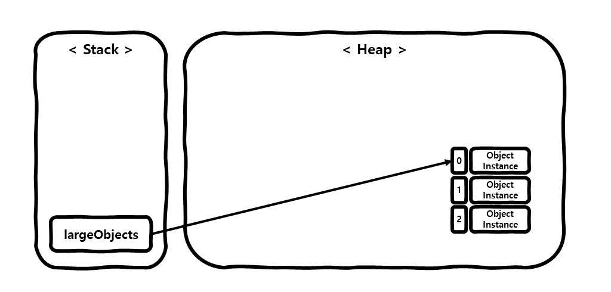
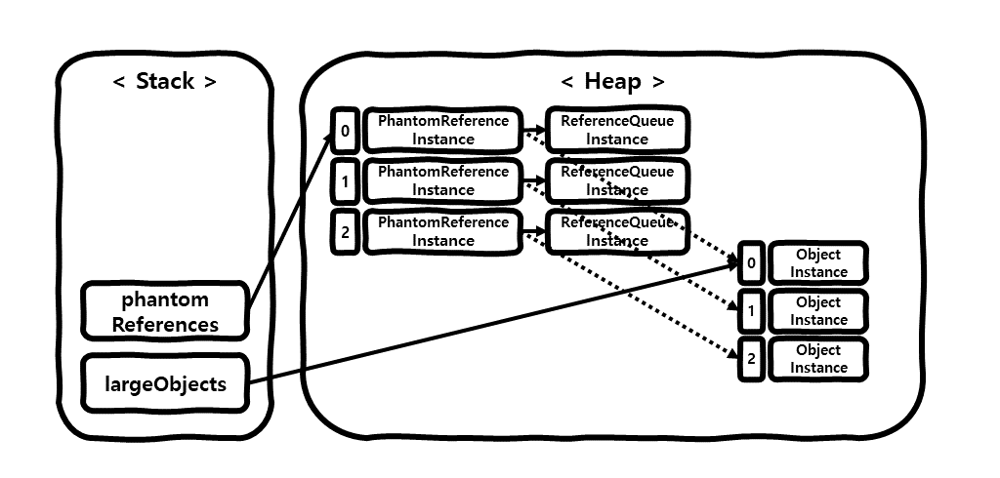
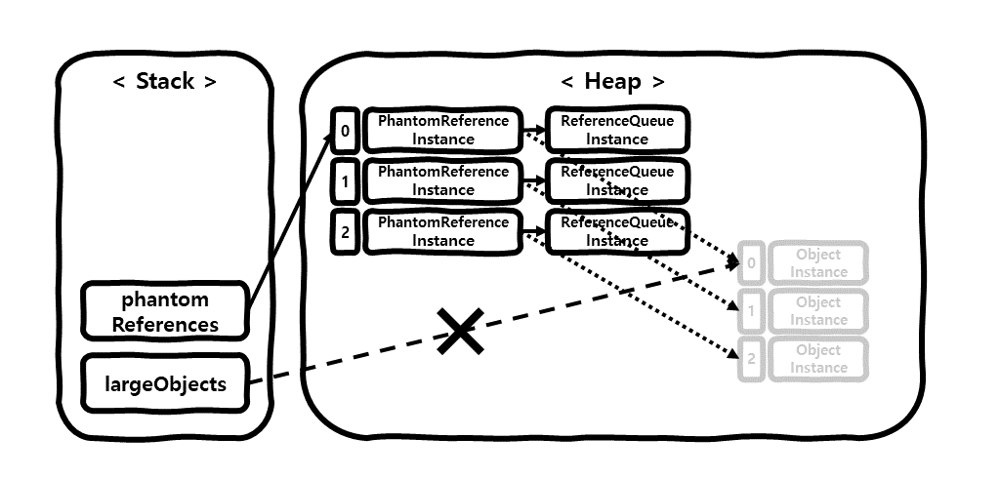
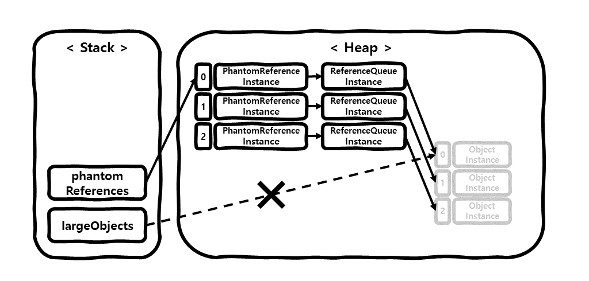

# 개요
이 포스팅에서는 Java의 References 종류 중 **Phantom Reference**의 사용 예시와 **[Phantom reachable](https://docs.oracle.com/javase/7/docs/api/java/lang/ref/package-summary.html)**의 특징에 대해 알아보겠습니다.   

# Reference 종류는 왜 나누어져 있는가?
Java의 Reference를 나누어 놓은 이유는 효율적인 GC 처리를 위함입니다.  
개발자는 적절한 Reference 사용하여, GC에 의해 제거될 데이터에 우선순위를 적용하여 좀더 효율적인 메모리 관리를 하기 위해 Reference의 종류를 나누어 제공하는 것 입니다.  
Reference는 4가지 종류 **[Strong Reference](/development/back-end/java/strong-reference-in-java)**,
**[Soft Reference](/development/back-end/java/soft-reference-in-java)**,
**[Weak Reference](/development/back-end/java/weak-reference-in-java)**, **Phantom Reference** 로 구분되어 있으며,
뒤로 갈수록 GC에 의해 제거될 우선순위가 높습니다.

# Phantom Rechable, Phantom Reference 란?
Phantom Reference는 **Soft Reference**, **Weak Reference**와 다르게, 사용하기 위함 보다는 **올바르게 삭제**하고
**삭제 이후 작업을 조작**하기 위함입니다.

* 올바르게 삭제  
  Java의 최상위 객체인 `Object`에는 여러 메서드들이 있는데 그중 `finalize()` 메서드가 있습니다. 이 메서드는 GC에 의해 호출 되지만, ***몇가지 문제점***이 있으며 잘못된 구현시 문제가 발생할 수 있습니다.  
  잘못된 구현의 예로는 GC에 의해 제거된 객체가 **부활(resurrect)**하는 것인데, 이는 `finalize()` 메서드에 **Strong Reference**를 갖도록 코딩되어 있을 경우 발생합니다.  
  하지만 **Phantom Reference**는 메모리에서 해지된 후 `enqueue`되기 때문에 `finalize()`에서 객체가 부활되는 문제가 없습니다.  
  (**Phantom Reference**의 `enqueue`에 대해서는 아래에서 좀더 자세히 알아보겠습니다.)

> `finalize()`의 문제점  
> 첫째, 언제 실행이 될지 모릅니다.  
> 둘째, GC에 따라 실행이 되지 않을 수 있습니다.  
> 셋째, 예외가 발생되면 무시됩니다.  
> 넷째, 성능 저가하 발생할 수 있습니다.

* 삭제 이후 작업을 조작  
  대용량의 데이터를 연속적으로 조작하는 경우, 데이터의 크기가 너무 크기 때문에 선행된 데이터가 삭제된 후에 다음 데이터를 조작해야 하는 경우가 있을 수 있습니다.  
  이럴 경우 **Phantom Referece**를 사용하여 메모리에서 데이터가 실질적으로 삭제된 후 다음 작업을 진행하도록 조작 할 수 있습니다.

객체가 **Phantom reachable** 하다는 것은, **Strongly reachable**, **Softly reachable**, **Weakly reachable** 하지 않으며
오직 **[PhantomReference](https://docs.oracle.com/javase/8/docs/api/java/lang/ref/PhantomReference.html)** 객체를 통해 도달할 수 있는 상태의 객체를 말합니다.

다음으로 **Phantom Reference**의 특징과 사용방법에 대해 알아보겠습니다.  
**Phantom Reference**는 **Soft Reference**, **Weak Reference**와 다르게 생성시 필수적으로 `ReferenceQueue`가 필요하며,
`PhantomReference`의 참조값을 수동으로 `clear()` 메서드를 실행해야하고, `PhantomReference.get()` 메서드는 항상 null을
반환한다는 특징이 있습니다.

> `PhantomReference.get()` 메서드 확인해 보면, 다음과 같이 항상 null을 반환하도록 되어 있습니다.
> ```java
> public class PhantomReference<T> extends Reference<T> {
>   // ...
> 
>   public T get() {
>     return null;
>   }
> }
> ```

```java
public class PhantomReferenceExample {
  public static void main(String[] args) {
    ReferenceQueue<Object> referenceQueue = new ReferenceQueue<>();
    List<PhantomReference<Object>> phantomReferences = new ArrayList<>;
    List<Object> largeObjects = new ArrayList<>();

    for (int i = 0; i < 3; i++) {
      /* 1) Strong Reference로 생성 */
      Object largeObject = new Ojbect();

      /* 2) 생성한 largeObject를 largeObjects에 담기 */
      largeObjects.add(largeObject);

      /* 3) Phantom Reference로 생성 */
      phantomReferences.add(new PhantomReference<>(largeObject, referenceQueue));
    }

    /*
      4) largeObjects에 null 할당
      Strong Reference인 largeObject를 unreachable 상태로 만듬
    */
    largeObjects = null;

    /*
      5) GC를 실행합니다.
      `System.gc()`을 호출 하더라도 바로 GC가 동작한다고 보장할수는 없지만, 예제상 GC가 동작하였다고 가정함
    */
    System.gc();

    for (PhantomReference<Object> phantomReference: phantomReferences) {
      /* 6) phantomReference가 ReferenceQueue에 들어갔는지 확인함 */
      if (phantomReference.isEnqueued()) {
        System.out.println("enqueued");
      }
    }

    Reference<?> referenceFromQueue;
    while ((referenceFromQueue = referenceQueue.poll()) != null) {
      /* 7) phantomReference 제거 전 수행할 업무를 처리함 */
      ((LargeObjectFinalizer) referenceFromQueue).finalizeResources();

      /* 8) phantomReference 객체를 수동으로 clear() */
      referenceFromQueue.clear();
    }
  }

  public static class LargeObjectFinalizer {
    public LargeObjectFinalizer(Object referent, ReferenceQueue<? super Object> q) {
      super(referent, q);
    }

    public void finalizeResources() {
      System.out.println("clearing...");
    }
  }
}
```

1. **Strong Reference**로 `Object` 클래스의 인스턴스를 생성하여 `largeObject`변수에 할당합니다.
2. `largeObject`를 `largeObjects` 리스트에 담습니다.
   
3. `largeObject`의 **Phantom Reference**를 생성하여 `phantomReferences`에 담습니다.
   
4. `largeObjects`에 null을 할당하여 `largeObject`를 Phantom reachable 상태로 만듭니다.
   
5. GC를 실행합니다. `System.gc()`을 호출 하더라도 바로 GC가 동작한다고 보장할수는 없지만, 예제상 GC가 동작하였다고 가정합니다.  
   GC에 의해 `phantomReference`의 참조값이 메모리에서 제거된 후, `referenceQueue`에 삽입됩니다.
   
6. `phantomReferences`의 요소들이 `referenceQueue`에 삽입되었는지 확인합니다.
7. `phantomReference`가 제거된 후 처리할 로직을 수행합니다.
8. `phantomReference`의 `clear()` 메소드를 직접 수행합니다.

위 코드를 실행시 출력은 다음과 같습니다.

```text
enqueued
enqueued
enqueued
clearing...
clearing...
clearing...
```

# 줄이며...
지금까지 Java의 References 중 하나인 **Phantom Reference**에 대해 알아보았습니다.  
**Phantom Reference**에 대한 정보와 사용에 대한 레퍼런스가 적어 정보를 확인함에 있어 어려움이 있었으나,
그만큼 스스로 오래 남을 것 같습니다.
