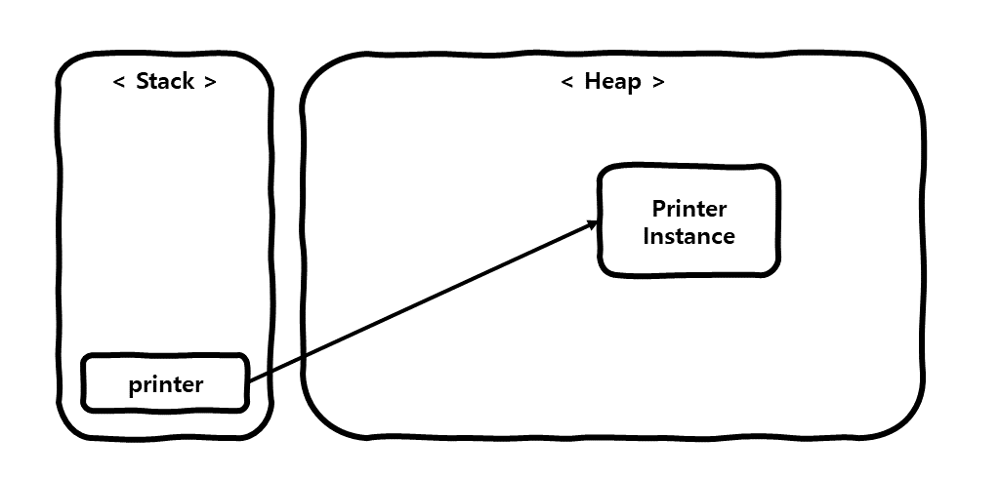
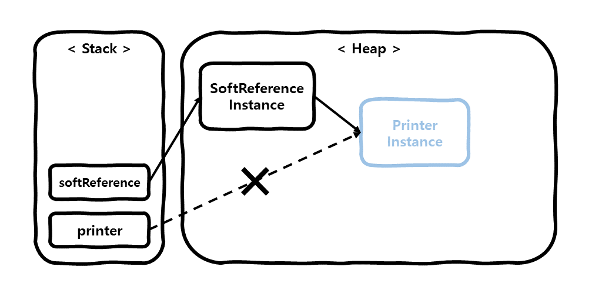

# 개요
이 포스팅에서는 Java의 References 종류 중 **Soft Reference**의 사용 예시와 **[Softly reachable](https://docs.oracle.com/javase/7/docs/api/java/lang/ref/package-summary.html)**의 특징에 대해 알아보겠습니다.   

# Reference 종류는 왜 나누어져 있는가?
Java의 Reference를 나누어 놓은 이유는 효율적인 GC 처리를 위함입니다.  
개발자는 적절한 Reference 사용하여, GC에 의해 제거될 데이터에 우선순위를 적용하여 좀더 효율적인 메모리 관리를 하기 위해 Reference의 종류를 나누어 제공하는 것 입니다.  
Reference는 4가지 종류 **[Strong Reference](/development/back-end/java/strong-reference-in-java)**, **Soft Reference**,
**[Weak Reference](/development/back-end/java/weak-reference-in-java)**, **[Phantom Reference](/development/back-end/java/phantom-reference-in-java)** 로
구분되어 있으며, 뒤로 갈수록 GC에 의해 제거될 우선순위가 높습니다.

# Softly Rechable, Soft Reference 란?
객체가 **Softly reachable** 하다는 것은, **Strongly reachable** 하지 않으며
오직 **[SoftReference](https://docs.oracle.com/javase/8/docs/api/java/lang/ref/SoftReference.html)** 객체를 통해
도달할 수 있는 상태의 객체를 말합니다.  
**Softly reachable**한 객체는 GC가 실행될 때 GC 알고리즘에 의해 메모리가 부족하다고 판단되면 메모리 제거 대상이 될수 있으며, 사용 방법은 다음과 같습니다.

> GC의 메모리 회수 대상이 된다고 하여도 즉각적으로 회수된다는 보장은 하지 못하며,
> 실질적인 메모리 회수 시점은 GC 알고리즘에 따라 다릅니다.

```java
public class SoftReferenceExample {
  public static void main(String[] args) {
    /* 1) Strong Reference로 생성 */
    Printer printer = new Printer();

    /* 2) print() 메서드 호출 */
    printer.print();

    /* 3) Soft Reference로 생성 */
    SoftReference<Printer> softReference = new SoftReference<>(printer);

    /* 4) Soft Reference값의 printer() 메서드 호출 */
    softReference.get()
      .print();

    /* 5) printer에 null 할당 */
    printer = null;

    /*
      6) GC를 실행합니다.
      `System.gc()`을 호출 하더라도 바로 GC가 동작한다고 보장할수는 없지만, 예제상 GC가 동작하였다고 가정함
    */
    System.gc();

    /*
      7) Soft Reference값의 printer() 메서드 호출
      `NullPointerException`이 날수도 있고, 아닐수도 있음
    */
    softReference.get()
      .print();
  }

  public static class Printer {
    public void print() {
      System.out.println("printing...");
    }
  }
}
```

1. Strong Reference로 `Printer` 클래스의 인스턴스를 생성하여 `printer`변수에 할당합니다.
   
2. `printer`의 메서드 `print()`를 호출합니다.
3. `printer`의 Soft Reference인 `softReference`를 생성합니다.
   
4. Soft Reference인 `printer`를 가져와서 `print()`를 호출합니다.
5. `printer`에 null을 할당하여 `printer`를 Soft reachable 상태로 만듭니다.
   
6. GC를 실행합니다. `System.gc()`을 호출 하더라도 바로 GC가 동작한다고 보장할수는 없지만, 예제상 GC가 동작하였다고 가정합니다.  
   GC의 알고리즘에 의해 메모리가 부족하다고 판단되면, `softReference`의 참조값은 메모리 회수 대상이 됩니다.
7. Soft Reference인 `printer`를 가져와서 `print()`를 호출합니다.  
   GC의 판단에 의해 `softReference`의 참조값이 메모리 회수 대상이 되었고, 실질적으로 메모리가 회수 되었다면
   NullPointerException이 발생하고, 그렇지 않다면 정상적으로 `print()` 메서드가 실행됩니다.

위 코드를 실행시 출력은 다음과 같습니다.

```text
printing...
printing...
printing... or NullPointerException
```

이와 같이 **Softly reachable**한 객체는 GC가 동작할 때 GC의 알고리즘에 의해 메모리 회수 대상이 결정되며,
메모리 회수 대상이 되더라도 GC가 즉각적으로 메모리를 제거한다는 보장은 할 수 없으며, 메모리 회수 시점은 GC 알고리즘에 따라 다름을 알 수 있습니다.  
하지만 GC에 의해 메모리 회수 대상이 된다는 점을 활용하여 캐싱에 **Soft Reference**를 사용시 문제가 발생할 수 있습니다.  
메모리가 부족할 때 GC가 동작하므로 **Soft Reference**를 사용하여 캐싱을 구현시, 다른 비즈니스 로직에 필요한 메모리가 부족하여
잦은 GC 동작으로 인해 성능에 이슈가 있을 수 있기 때문입니다.

# 줄이며...
지금까지 Java의 References 중 하나인 **Soft Reference**에 대해 알아보았습니다.  
또한, 캐싱을 위해서는 **Soft Reference** 보다는 **Weak Reference**가 적절하다는 것을 알아가면 좋을 것 같습니다. 
