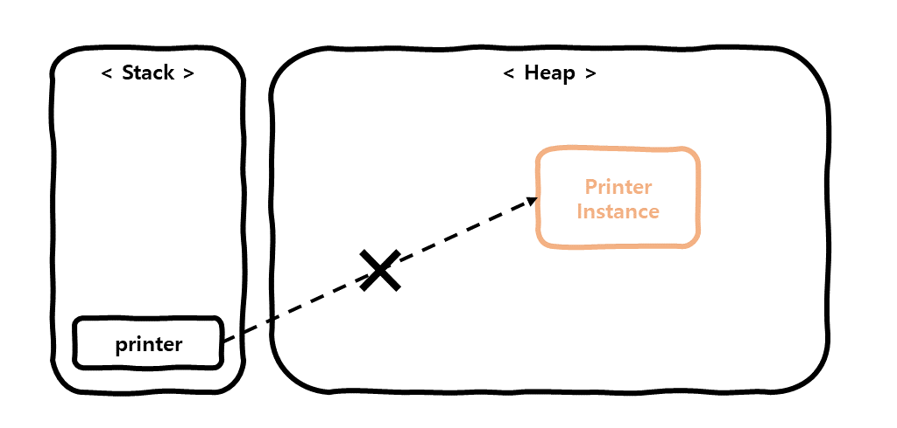

# 개요
이 포스팅에서는 Java의 References 종류 중 **Strong Reference**의 사용 예시와 **Strongly reachable**의 특징에 대해 알아보겠습니다.   

# Reference 종류는 왜 나누어져 있는가?
Java의 Reference를 나누어 놓은 이유는 효율적인 GC 처리를 위함입니다.  
개발자는 적절한 Reference 사용하여, GC에 의해 제거될 데이터에 우선순위를 적용하여 좀더 효율적인 메모리 관리를 하기 위해 Reference의 종류를 나누어 제공하는 것 입니다.  
Reference는 4가지 종류 **Strong Reference**, **[Soft Reference](/development/back-end/java/soft-reference-in-java)**,
**[Weak Reference](/development/back-end/java/weak-reference-in-java)**, **[Phantom Reference](/development/back-end/java/phantom-reference-in-java)** 로
구분되어 있으며, 뒤로 갈수록 GC에 의해 제거될 우선순위가 높습니다.

# Strongly Rechable, Strong Reference 란?
객체가 **Strongly reachable** 하다는 것은, 특정 스레드(thread)로 부터 해당 객체까지 어떠한 참조 객체도 통하지 않고 도달할 수 있는 상태의 객체를 말합니다.  
**Strong Reference**는 GC가 실행될 때 unreachable 상태일 경우 GC에 의해 제거될 수 있으며,
사용 방법은 우리가 기본적으로 Java에서 변수를 선언하는 방식으로 다음과 같습니다.  

```java
public class StrongReferenceExample {
  public static void main(String[] args) {
    /* 1) Strong Reference로 생성 */
    Printer printer = new Printer();

    /* 2) print() 메서드 호출 */
    printer.print();

    /*
      3) printer에 null 할당
      이제부터 printer의 heap 데이터는 GC에 의해 제거될 가능성이 있음
    */
    printer = null;
  }

  public static class Printer {
    public void print() {
      System.out.println("printing...");
    }
  }
}
```

1. **Strong Reference**로 `Printer` 클래스의 인스턴스를 생성하여 `printer` 변수에 할당합니다.
   
2. `printer`의 메서드 `print()`를 호출합니다.
3. `printer`에 null을 할당하여, Heap 메모리의 `Printer` 클래스의 인스턴스는 unreachable 상태가 되고, 향후 GC에 의해 제거될 수 있습니다.
   

위 코드를 실행시 출력은 다음과 같습니다.  
 
```text
printing...
```

이와 같이 **Strong Reference**는 개발자가 임의로 null을 할당 하거나, 객체가 unreachable 상태가 되어야 메모리에서 해제가 된다는 것을 알아 가시면 좋을 것 같습니다.

# 줄이며...
지금까지 Java의 References 중 하나인 **Strong Reference**에 대해 알아보았으나, 일반적으로 사용하던 방식이라 별다른 특별한 점을 느끼지는 못하셨을 것 같습니다.  
이번 포스팅은 **Strong Reference** 보다는 이후 설명드릴 다른 References와 비교를 위한 자리로 봐주시면 감사하겠습니다.
