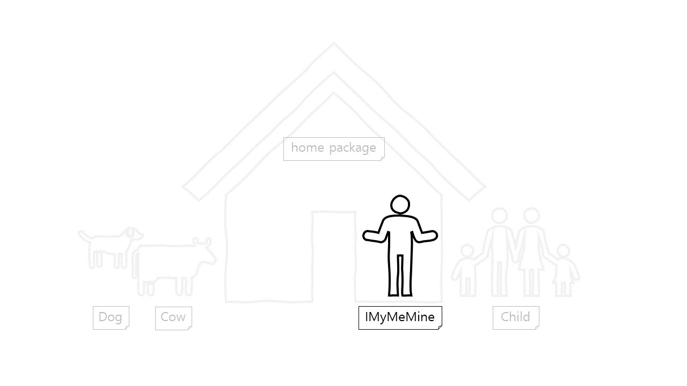
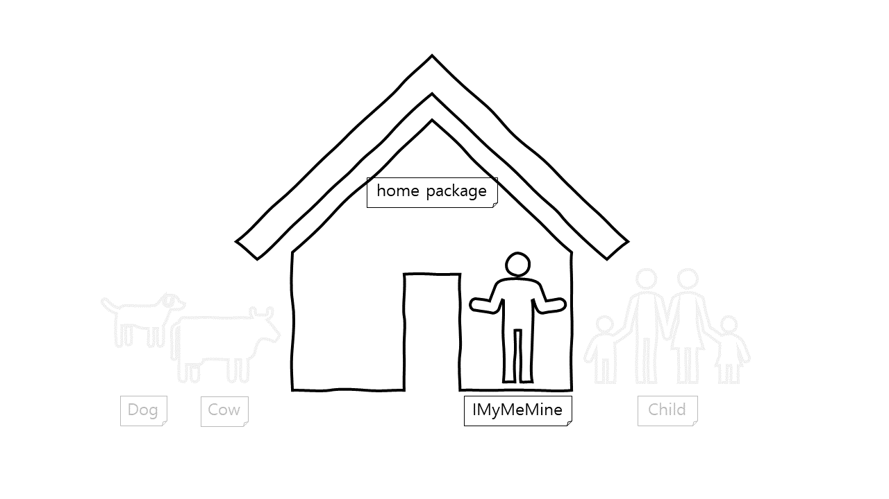
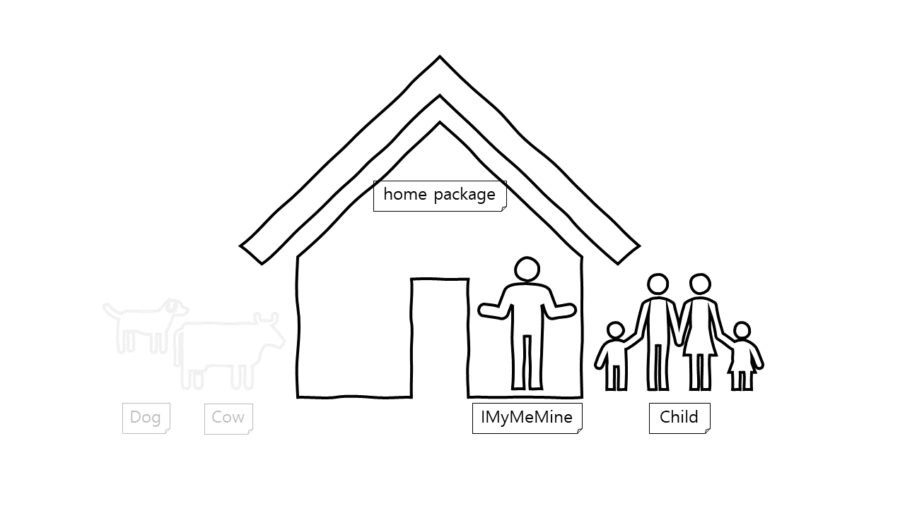
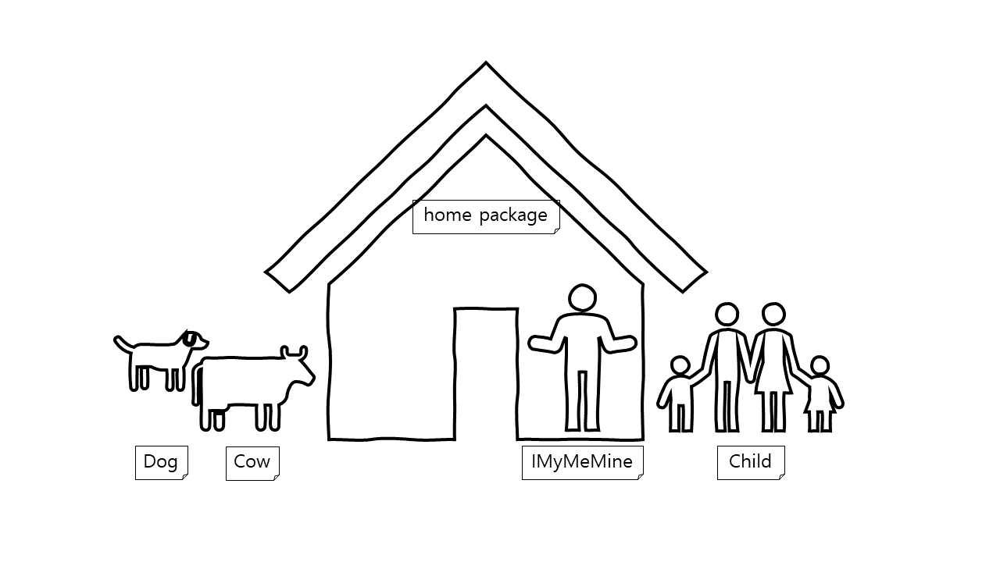

# 개요
이 포스팅에서는 Java의 접근 제어자의 종류에 대해 알아보고, 각 접근제어자별 차이점에 대해 알아보도록 하겠습니다.

# 접근 제어자(Access Modifier) 란?
Java의 인터페이스, 클래스, 메서드 그리고 변수 앞에 선언하며, 접근할 수 있는 범위를 한정해 주는 역할을 합니다.  
접근 제어자의 종류는 4가지로 `private` < `default` < `protected` < `public` 가 존재하며, 오른쪽으로 갈수록 접근 허용 범위가 커집니다.  
이러한 접근제어자를 통해 클래스 외부에 불필요한 노출을 줄일 수 있으며, 보다 유지보수가 용이한 프로그래밍이 가능하도록 도와줍니다.  
또한, 접근 제어를 통해 객체지향 프로그래밍(OOP, Object Oriented Programing)의 4대 특성 중 하나인, 캡슐화(Encapsulation)를 가능하도록 합니다.

# 접근 제어자의 종류 및 예시
접근 제어자의 종류와 특성을 예시를 통해 알아보도록 하겠습니다.  
예시에 사용될 프로젝트 구조는 다음과 같습니다.
```text
.
└─ com.example
│ └─ home
│ │ └─ IMyMeMine.java
│ │ └─ Main.java
│ └─ Child.java
│ └─ Dog.java
│ └─ Cow.java
```

## Private 제어자
`private` 제어자가 붙은 인터페이스, 클래스, 메서드 그리고 변수는 해당 클래스 내에서만 접근이 가능합니다.  
**즉, `private` 제어자의 접근 허용 범위는 동일 클래스입니다.**



`IMyMeMine` 클래스를 살펴보겠습니다.
```java
public class IMyMeMine {
  private String name;

  IMyMeMine() {
    /* private 변수 사용 */
    String myName = this.name;

    /* private 메서드 사용 */
    this.say();

    /* private 클래스 사용 */
    Wallet myWallet = new Wallet();
  }

  private void say() {}

  private interface Storable {
    void store();
  }

  /* private 인터페이스 사용 */
  private static class Wallet implements Storable {
    public Wallet() {}

    @Override
    public void store() {}
  }
}
```
`IMyMeMine` 클래스 내부에서, 동일 클래스 내의 `private` 제어자를 자유롭게 접근할 수 있습니다.

이번에는 `Main` 클래스를 살펴보겠습니다.
```java
public class Main {
  public static void main(String[] args) {
    IMyMeMine iMyMeMine = new IMyMeMine();

    /* private 변수 사용불가 */
    // String myName = iMyMeMine.name;

    /* private 메서드 사용불가 */
    // iMyMeMine.say();

    /* private 클래스 사용불가 */
    // IMyMeMine.Wallet wallet = new IMyMeMine.Wallet();
  }
  
  /* private 인터페이스 사용불가 */
  // public static class NestedClass implements IMyMeMine.Storable {
  //   @Override
  //   public void store() {}
  // }
}
```
`Main` 클래스는 `IMyMeMine` 클래스와 동일 클래스가 아니므로, `Main` 클래스 에서는 `IMyMeMine` 클래스 내부의 `private` 제어자로 선언된 클래스, 인터페이스, 메서드 그리고 변수를 사용할 수 없습니다.

## Default 제어자
`default` 제어자는 아무 접근 제어자도 설정하지 않을 경우에 `default` 제어자가 설정 되며, `default` 제어자가 붙은 인터페이스, 클래스, 메서드 그리고 변수는 `private` 접근 권한 + 동일 패키지 내에서만 접근이 가능합니다.  
**즉, `default` 제어자의 접근 허용 범위는 동일 클래스 + 동일 패키지입니다.**



`IMyMeMine` 클래스를 살펴보겠습니다.
```java
class IMyMeMine {
  String name;

  IMyMeMine() {
    /* default 변수 사용 */
    String myName = this.name;

    /* default 메서드 사용 */
    this.say();

    /* default 클래스 사용 */
    Wallet myWallet = new Wallet();
  }

  void say() {}

  interface Storable {
    void store();
  }

  /* default 인터페이스 사용 */
  static class Wallet implements Storable {
    public Wallet() {}

    @Override
    public void store() {}
  }
}
```
`default` 제어자는 `private` 제어자의 접근 권한을 포함하므로, 클래스 내부에서는 `default` 제어자를 자유롭게 접근할 수 있습니다.

이번에는 `Main` 클래스를 살펴보겠습니다.
```java
public class Main {
  public static void main(String[] args) {
    IMyMeMine iMyMeMine = new IMyMeMine();

    /* private 변수 사용 */
    String myName = iMyMeMine.name;

    /* private 메서드 사용 */
    iMyMeMine.say();

    /* private 클래스 사용 */
    IMyMeMine.Wallet wallet = new IMyMeMine.Wallet();
  }
  
  /* private 인터페이스 사용 */
  public static class NestedClass implements IMyMeMine.Storable {
    @Override
    public void store() {}
  }
}
```
`Main` 클래스와 `IMyMeMine` 클래스는 동일 패키지에 있으므로, `private` 제어자 때와는 다르게 `Main` 클래스에서 `IMyMeMine` 클래스의 `default` 제어자로 선언된 클래스, 인터페이스, 메서드 그리고 변수 사용이 가능합니다.

이번에는 `Child` 클래스를 살펴보겠습니다.
```java
class Child {
  Child() {
    /* default 클래스 사용불가 */
    // IMyMeMine iMyMeMine = new IMyMeMine();

    /* default 변수 사용불가 */
    // String myName = iMyMeMine.name;

    /* default 메서드 사용불가 */
    // iMyMeMine.say();

    /* default 클래스 사용불가 */
    // IMyMeMine.Wallet wallet = new IMyMeMine.Wallet();
  }

  /* default 인터페이스 사용불가 */
  // public static class NestedClass implements IMyMeMine.Storable {
  //   @Override
  //   public void store() {}
  // }
}
```
`Child` 클래스는 `IMyMeMine` 클래스와 다른 패키지에 있으므로, `Child` 클래스에서 `IMyMeMine` 클래스의 `default` 제어자로 선언된 클래스, 인터페이스, 메서드 그리고 변수를 사용할 수 없습니다.

## Protected 제어자
`protected` 제어자가 붙은 인터페이스, 클래스, 메서드 그리고 변수는 `default` 접근 권한 + 자식 클래스에서 접근이 가능합니다.  
**즉, `protected` 제어자의 접근 허용 범위는 동일 클래스 + 동일 패키지 + 자식 클래스입니다.**



`IMyMeMine` 클래스를 살펴보겠습니다.
```java
public class IMyMeMine {
  protected String name;

  protected IMyMeMine() {
    String myName = this.name;
    this.say();
    Wallet myWallet = new Wallet();
  }

  protected void say() {}

  protected interface Storable {
    void store();
  }

  protected static class Wallet implements Storable {
    public Wallet() {}

    @Override
    public void store() {}
  }
}
```
`protected` 제어자는 `default` 제어자의 접근 권한을 포함하므로, 클래스 내부에서는 `protected` 제어자를 자유롭게 접근할 수 있습니다.

이번에는 `Child` 클래스를 살펴보겠습니다.
```java
class Child extends IMyMeMine {
  Child() {
    /* protected 변수 사용 */
    String myName = this.name;

    /* protected 메서드 사용 */
    this.say();

    /* protected 클래스 사용 */
    Wallet myWallet = new Wallet();
  }

  /* protected 인터페이스 사용 */
  public static class NestedClass implements IMyMeMine.Storable {
    @Override
    public void store() {
    }
  }
}
```
`Child` 클래스는 `IMyMeMine` 클래스를 상속하였으므로, `Child` 클래스에서 `IMyMeMine` 클래스의 `protected` 제어자로 선언된 클래스, 인터페이스, 메서드 그리고 변수 사용이 가능합니다.

이번에는 `Dog` 클래스를 살펴보겠습니다.
```java
class Dog {
  Dog() {
    /* protected 변수 사용불가 */
    // String myName = this.name;

    /* protected 메서드 사용불가 */
    // this.say();

    /* protected 클래스 사용불가 */
    // Wallet myWallet = new Wallet();
  }

  /* protected 인터페이스 사용불가 */
  // public static class NestedClass implements Storable {
  //   @Override
  //   public void store() {}
  // }
}
```
`Dog` 클래스는 `IMyMeMine` 클래스를 상속하지 않았으므로, `Dog` 클래스에서 `IMyMeMine` 클래스의 `protected` 제어자로 선언된 클래스, 인터페이스, 메서드 그리고 변수를 사용할 수 없습니다.

## Public 제어자
`public` 제어자가 붙은 인터페이스, 클래스, 메서드 그리고 변수는 동일 프로젝트 내에서는 어디서든 자유롭게 접근이 가능합니다.



`IMyMeMine` 클래스를 살펴보겠습니다.
```java
public class IMyMeMine {
  public String name;

  public IMyMeMine() {
    String myName = this.name;
    this.say();
    Wallet myWallet = new Wallet();
  }

  public void say() {}

  public interface Storable {
    void store();
  }

  public static class Wallet implements Storable {
    public Wallet() {}

    @Override
    public void store() {}
  }
}
```

이번에는 `Cow` 클래스를 살펴보겠습니다.
```java
class Cow {
  public Cow() {
    IMyMeMine iMyMeMine = new IMyMeMine();

    /* public 변수 사용 */
    String myName = iMyMeMine.name;

    /* public 메서드 사용 */
    iMyMeMine.say();

    /* public 클래스 사용 */
    IMyMeMine.Wallet wallet = new IMyMeMine.Wallet();
  }

  /* public 인터페이스 사용 */
  public static class NestedClass implements IMyMeMine.Storable {
    @Override
    public void store() {}
  }
}
```
`IMyMeMine` 클래스와 `Cow` 클래스에서 모두 `IMyMeMine` 클래스의 `public` 제어자로 선언된 클래스, 인터페이스, 메서드 그리고 변수 사용이 가능합니다.

# 요약
지금까지 예시를 통한 각각의 접근 제어자에 대해 알아보았습니다.  
접근 제어자별 접근 가능한 권한을 표로 한눈에 나타내자면 다음과 같습니다.  

| 구분 \ 접근 제어자 | private | default | protected | public |
|:---:|:---:|:---:|:---:|:---:|
| 동일 클래스 | O | O | O | O |
| 동일 패키지 | X | O | O | O |
| 자식 클래스 | X | X | O | O |
| 모든 클래스 | X | X | X | O |
