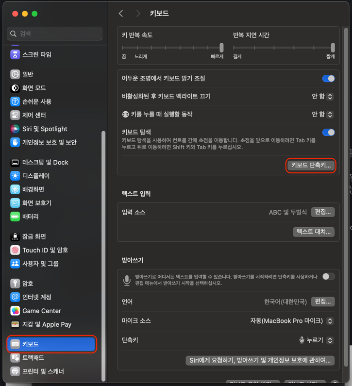
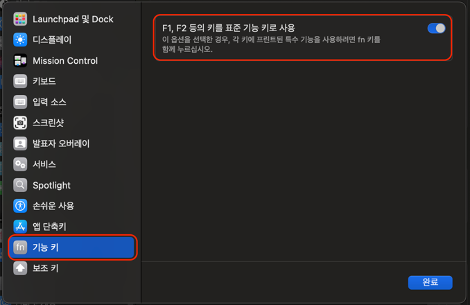

# 개요
 이 포스팅에서는 MacOS에서 fn 키를 누르지 않고 F1 ~ F12 키를 사용하는 방법에 대해 소개하고자 합니다.


링크 : https://velog.io/@mertyn88/Rancher-desktop%EC%9C%BC%EB%A1%9C-Elasticsearch-%EA%B5%AC%EB%8F%99%ED%95%98%EA%B8%B0
> brew install docker
> brew install docker-compose
> brew install --cask rancher

rancher 실행

> git clone https://github.com/deviantony/docker-elk.git
> cd docker-elk

[elasticsearch](https://github.com/deviantony/docker-elk?tab=readme-ov-file#how-to-disable-paid-features) license [trail 에서 basic 으로 변경](https://github.com/deviantony/docker-elk?tab=readme-ov-file#how-to-disable-paid-features)

> docker-compose up setup

> 오류 : failed to solve: error getting credentials - err: exec: "docker-credential-osxkeychain": executable file not found in $PATH, out: ``
> [관련 링크](https://sparkbyexamples.com/docker/docker-error-storing-credentials-err-exec-docker-credential-desktop-executable-file-not-found-in-path-out/)
> `brew install docker-credential-helper`

> docker-compose up

http://localhost:5601/ 접속
- user: elastic
- password: changeme 
- new pw : bGNAmsyzeDHER89

> docker-compose exec elasticsearch bin/elasticsearch-reset-password --batch --user elastic  
> wSYYVhtK-lXcoXcG5-BA

> docker-compose exec elasticsearch bin/elasticsearch-reset-password --batch --user logstash_internal  
> PO=-ezJz6uFtjIneZf8Q

> docker-compose exec elasticsearch bin/elasticsearch-reset-password --batch --user kibana_system  
> a2ydGt_IoG2GodkpV=e6

[.env](https://github.com/deviantony/docker-elk/blob/main/.env) 파일의 `changeme`로 작성된 비밀번호를 위 명령어 통해 랜덤으로 생성된 비밀번호로 바꿔줍니다.

시스템 재시작
> docker-compose up -d logstash kibana

로그 전송 테스트

> cat /path/to/logfile.log | nc -c localhost 50000

데이터 제거
> docker-compose down -v


> docker pull docker.elastic.co/elasticsearch/elasticsearch:8.12.1


# docker network
https://www.daleseo.com/docker-networks/
- 네트워크 보기
  - `docker network ls`
- 네트워크 생성
  - `docker network create <network name>`
- 네트워크 제거
  - `docker network rm <network name>`

> 오류 : docker: Error response from daemon: network elk-stack-net not found.  
> 네트워크 생성이 필요  
> `docker network create elk-stack-net`


> 오류 : docker: Error response from daemon: Conflict. The container name "/elasticsearch-container" is already in use by container  
> `docker ps -a` // 도커 프로세스 확인  
> `docker rm <container id>` // 도커 프로세스 제거  

# 설치
## elasticsearch
### 이미지 pull
[elasticsearch docker](https://www.docker.elastic.co/r/elasticsearch) 에서 희망 버전을 선택하여 설치
```shell
docker pull docker.elastic.co/elasticsearch/elasticsearch:8.12.1-arm64
```

### container 실행
elasticsearch 의 이미지 버전은 위에서 pull 받은 버전과 맞춘다
```shell
sudo docker run -d \
-p 9200:9200 -p 9300:9300 \
-v data:/usr/share/elasticsearch/data \
-v logs:/usr/share/elasticsearch/logs \
-e "discovery.type=single-node" \
-e TZ=Asia/Seoul \
--name elasticsearch-container \
--network elk-stack-net \
docker.elastic.co/elasticsearch/elasticsearch:8.12.1-arm64
```


# 요약
1. Apple 메뉴 > 시스템 환경설정을 선택합니다.
2. 좌측 메뉴에서 '키보드' 를 클릭 후, '키보드 단축키...' 를 클릭합니다.
3. '기능키' 의 'F1, F2 등의 키를 표준 기능 키로 사용' 을 체크합니다.

---

# fn 키 누르지 않고 F1 ~ F12 키 사용하기
 기본적으로 Apple 키보드의 맨 윗줄에 있는 키는 Mac의 다양한 기능을 제어합니다.
예를 들어 **스피커 아이콘**이 있는 키를 누르면 *음량을 조절*할 수 있습니다.  
반대로, 표준 기능 키를 사용하려면 fn 키를 누른 상태에서 특정 기능 키를 누르면 됩니다.
예를 들어, **fn 키와 F12(스피커 아이콘) 키**를 함께 누르면 스피커 음량을 높이는 대신 *F12 키*에 지정된 작업이 수행됩니다.

 개인적으로 **음량 조절** 이나 **화면 밝기 조절** 보다 *표준 기능 키*의 사용 빈도가 높아 이를 반전해서 사용합니다.
저와 같은 상황의 경우 **기능 키 반전 사용**을 추천합니다.

## 설정 방법
1. Apple 메뉴 > 시스템 환경설정을 선택합니다.



2. 좌측 메뉴에서 '키보드' 를 클릭 후, '키보드 단축키...' 를 클릭합니다.
3. 'F1, F2 등의 키를 표준 기능 키로 사용'을 체크합니다.


