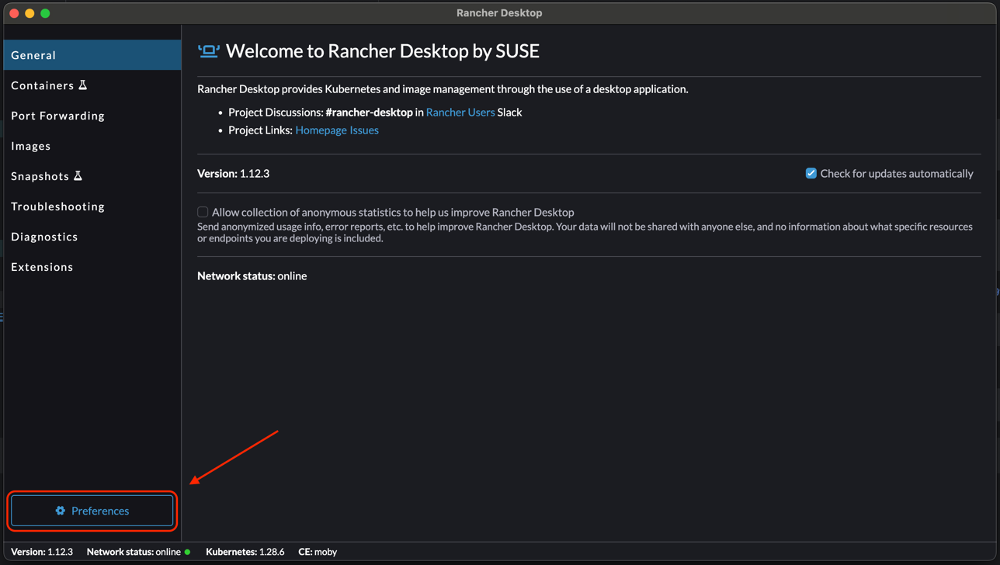
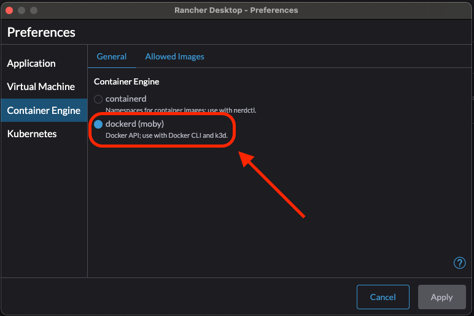

# 개요
 이 포스팅에서는 MacOS에서 Docker를 손쉽게 사용하기 위한 Rancher Desktop을 설치하는 방법에 대해 소개하고자 합니다.

## 사전 준비
mac에 brew가 설치되지 않았다면, [Homebrew 설치 방법](https://luckydavekim.github.io/development/etc/mac-os/install-homebrew/)을 참고해서 설치해주세요.

---

# TL;DR

```shell
brew install --cask rancher
brew install docker
brew install docker-compose
```

# Rancher Desktop 이란?
 [Rancher Desktop](https://rancherdesktop.io/)은 Windows 혹은 MacOS에서 Docker를 실행할 수 있도록 도와주는 프로그램입니다. [Docker Desktop](https://www.docker.com/products/docker-desktop/)이 [유료](https://www.docker.com/pricing/)로 전환되며 대체제로 새롭게 조명받게 됐습니다.

> 참고 : Docker는 기술적으로 Linux에서만 구동할 수 있습니다.

# Rancher Desktop 설치
`brew` 명령어를 사용해 손쉽게 Rancher Desktop을 설치할 수 있습니다.

```shell
brew install --cask rancher
```

그리고 Docker를 설치해줍니다.

```shell
brew install docker
```

# Rancher Desktop 설정

## Rancher Desktop Path 등록
각자 mac 환경에서 사용 중인 쉘 종류에 따라 아래 명령어를 선택하여 실행합니다.

### bash 쉘을 사용하는 경우...

```shell
echo 'export PATH="$PATH:$HOME/.rd/bin"' >> ~/.bashrc
source ~/.bashrc
```

### zsh 쉘을 사용하는 경우...

```shell
echo 'export PATH="$PATH:$HOME/.rd/bin"' >> ~/.zshrc
source ~/.zshrc
```

# Container engine 설정
설치한 Rancher Desktop을 실행 후, container engine을 Docker로 설정해줍니다.





# Rancher Desktop 설치 확인
`hello-world` 이미지를 Docker로 실행해서 정상적으로 Rancher Desktop이 설치되었는지 확인합니다.

```shell
docker run hello-world
```

정상적으로 Rancher Desktop이 설치되었다면, 이미지를 받아와서 아래와 같이 뜹니다.

```text
Hello from Docker!
This message shows that your installation appears to be working correctly.

To generate this message, Docker took the following steps:
 1. The Docker client contacted the Docker daemon.
 2. The Docker daemon pulled the "hello-world" image from the Docker Hub.
    (arm64v8)
 3. The Docker daemon created a new container from that image which runs the
    executable that produces the output you are currently reading.
 4. The Docker daemon streamed that output to the Docker client, which sent it
    to your terminal.

To try something more ambitious, you can run an Ubuntu container with:
 $ docker run -it ubuntu bash

Share images, automate workflows, and more with a free Docker ID:
 https://hub.docker.com/

For more examples and ideas, visit:
 https://docs.docker.com/get-started
```

# 줄이며...
MacOS에서 Docker Desktop을 대체할 수 있는 `Rancher Desktop` 을 설치하는 방법에 대해 알아보있습니다.  
앞으로 Docker로 손쉽게 다양한 환경을 실행해보겠습니다!
