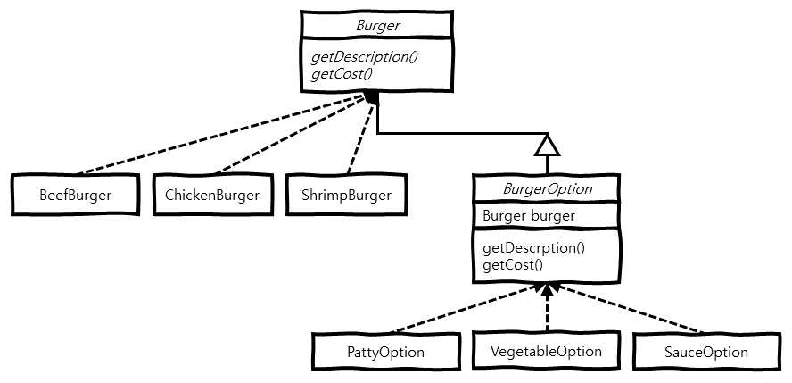

> 본 내용은 **Head First 디자인 패턴**(Eric Freeman, Elisabeth Freeman, Kathy Sierra, Bert Bates 지음, 서환수 옮김)을 읽은 후, 생각을 정리한 내용입니다.  
> 보다 상세한 내용이 궁금하신 분은 해당 책을 읽어보는 것을 추천합니다. 

# 개요
 데코레이터 패턴(Decorator Pattern)에 대해 알아보고, 구현 방법 및 예시에 대해 알아봅니다.

# 의도 (Intent)
 객체에 추가적인 요건을 동적으로 첨가하고, 데코레이터는 서브클래스를 만드는 것을 통해서 기능을 유연하게 확장할 수 있는 방법을 제공합니다.

# 동기 (Motivation)
 햄버거 매장에서는 기본으로 제공되는 햄버거에 패티 추가, 소스 추가 등 여러 추가 옵션을 설정할 수 있습니다.  
이 경우 햄버거 종류와 추가 옵션의 모든 조합을 클래스로 만들어 놓는다면 어마어마한 수의 클래스를 만들어야 하고, 그 중 햄버거 혹은 추가 
옵션의 정보가 바뀌었을 때, 이를 수정하기도 만만치 않을 것 입니다.

 쉬운 예제로 **3개의 버거 종류** *소고기 버거*, *치킨 버거*, *쉬림프 버거*와 **3개의 추가 옵션** *패티 추가*, *야채 추가*,
*소스 추가*를 예로 들어보겠습니다.  
 위 버거와 추가 옵션의 모든 조합을 클래스로 만든다고 할 때, 각 버거별 가능한 추가 옵션의 조합은 **3C3 + 3C2 + 3C1** 해서 7개 
조합이 나오며, 버거의 종류는 3가지 이므로 **7 * 3** 해서 만들어야 하는 클래스의 수는 **21개** 입니다.  
 만들고 관리할 수 있을만한 클래스 수로 보이나요? 그렇다면 햄버거 하나와 추가 옵션 하나씩 늘었을 경우를 보겠습니다.
**(4C4 + 4C3 + 4C2 + 4C1) * 4** 해서 총 **84개**의 클래스를 만들어야 합니다.  
 이와 같이 모든 추가 옵션에 대한 조합을 클래스로 미리 만들어 놓는 것은 비효율적입니다.

 해결 방법으로는 **데코레이터 패턴**을 사용해서 런타임에 원하는 조합을 진행하는 것 입니다.  
 햄버거를 추상화한 `Burger` 추상 클래스를 만들고, `Burger`를 상속한 `BeefBurger`, `ChickenBurger`, `ShrimpBurger` 클래스를
만듭니다.  
그리고 `BurgerOption` 추상 클래스를 상속한 `PattyOption`, `VegetableOption`, `SauceOption` 클래스를 만듭니다.  
 사용할 때는 `Burger`를 상속한 클래스를 `BuggerOption`을 상속한 클래스로 감싸서 원하는 추가 옵션을 적용하는 방식으로 사용합니다.  
 `BugerOption`을 상속하는 추가 옵션 클래스는 `Burger` 추상 클래스를 통해 인자를 전달 받기 때문에 기존 코드에 수정없이 자유롭게
확장이 가능하고 또한, `Burger` 추상 클래스를 상속한 햄버거 클래스도 자유롭게 확장이 가능합니다.

# 구조 (Structure)
 데코레이터 패턴의 주요 구조는 다음과 같습니다.



- **Burger** 추상 클래스 :  
  `getDescription()` 메서드는 햄버거의 종류 및 추가된 옵션을 반환하고,  
  `getCost()` 메서드는 햄버거 및 추가된 옵션에 따른 가격을 반환합니다.
- **BeefBurger**, **ChickenBurger**, **ShrimpBurger** 클래스 :  
  각 클래스는 `Burger` 추상 클래스를 상속하고,  
  `getDescription()` 메서드는 해당 햄버거의 이름을 반환하고,  
  `getCost()` 메서드는 해당 햄버거의 가격을 반환합니다.
- **BurgerOption** 추상 클래스 :  
  `Burger` 추상 클래스를 상속하고,  
  `Burger`를 맴버 변수로 담고,  
  `getDescription()` 메서드를 오버라이드 해서 추가 옵션 이름과 `Burger` 이름을 함께 반환하고,  
  `getCost()` 메서드를 오버라이드 해서 추가 옵션 가격과 `Burger` 가격을 합쳐서 반환합니다.
- **PattyOption**, **VegetableOption**, **SauceOption** 클래스 :  
  각 클래스는 `BurgerOption` 추상 클래스를 상속하고,  
  `getDescription()` 메서드를 오버라이드 해서 추가 옵션 이름과 `Burger` 이름을 함께 반환하고,  
  `getCost()` 메서드를 오버라이드 해서 추가 옵션 가격과 `Burger` 가격을 합쳐서 반환합니다.

# 예제 (Example)
 데코레이터 패턴의 예제입니다.

```java
public abstract class Burger {

  private String description;
  private Long cost;

  protected Burger(String description, Long cost) {
    this.description = description;
    this.cost = cost;
  }

  String getDescription() {
    return this.description;
  }

  Long getCost() {
    return this.cost;
  }

}


public class BeefBurger extends Burger {

  public BeefBurger() {
    super("소고기 버거", 7000L);
  }

}


public class ChickenBurger extends Burger {

  public ChickenBurger() {
    super("치킨 버거", 5000L);
  }

}


public class ShrimpBurger extends Burger {

  public ShrimpBurger() {
    super("새우 버거", 6000L);
  }

}
```

 `Burger` 추상 클래스에서는 햄버거 설명을 나타내는 `description` 맴버 변수와, 햄버거 가격을 나타내는 `cost` 맴버 변수를 설정하고 
`Burger` 추상 클래스를 상속한 `BeefBurger`, `ChickenBurger`, `ShrimpBurger` 클래스를 만들어서 햄버거 설명과 가격을 설정합니다.

```java
public abstract class BurgerOption extends Burger {

  private Burger burger;

  protected BurgerOption(String description, Long cost, Burger burger) {
    super(description, cost);
    this.burger = burger;
  }

  @Override
  String getDescription() {
    String burgerDescription = this.burger.getDescription();
    String optionDescription = super.getDescription();

    return String.format("%s, %s", burgerDescription, optionDescription);
  }

  @Override
  Long getCost() {
    Long burgerCost = this.burger.getCost();
    Long optionCost = super.getCost();

    return burgerCost + optionCost;
  }

}


public class PattyOption extends BurgerOption {

  public PattyOption(Burger burger) {
    super("패티 추가", 500L, burger);
  }

}


public class VegetableOption extends BurgerOption {

  public VegetableOption(Burger burger) {
    super("패티 추가", 300L, burger);
  }

}


public class SauceOption extends BurgerOption {

  public SauceOption(Burger burger) {
    super("소스 추가", 100L, burger);
  }

}
```

 `Burger` 추상 클래스를 상속하고, 추가 옵션 정보를 추상화한 `BurgerOption` 추상 클래스를 만듭니다.  
 `BurgerOption` 추상 클래스에서는 `getDescription()` 메서드를 오버라이드해서 입력받은 버거와 추가 옵션의 설명을 조합해서 반환하고, 
`getCost()` 메서드를 오버라이드해서 입력받은 버거와 추가 옵션의 가격을 더해서 반환합니다.
 `BurgerOption` 추상 클래스를 상속한 `PattyOption`, `VegetableOption`, `SauceOption` 클래스를 만들어서 추가 옵션의 설명과 
가격을 설정합니다.

```java
public class Main {

  public static void main(String[] args) {
    Burger beefBurger = new BeefBurger();
    beefBurger = new PattyOption(beefBurger);
    beefBurger = new PattyOption(beefBurger);
    beefBurger = new VegetableOption(beefBurger);
    beefBurger = new SauceOption(beefBurger);

    System.out.printf("버거 이름 : %s; 가격 : %d\n", beefBurger.getDescription(), beefBurger.getCost());


    Burger shrimpBurger = new ShrimpBurger();
    shrimpBurger = new PattyOption(shrimpBurger);
    shrimpBurger = new SauceOption(shrimpBurger);

    System.out.printf("버거 이름 : %s; 가격 : %d\n", shrimpBurger.getDescription(), shrimpBurger.getCost());
  }

}
```

 이제 **소고기 버거**에 **패티 2장**, **야채**, **소스**를 추가한 햄버거 하나와, 
**새우 버거**에 **패티**, **소스**를 추가한 햄버거를 만듭니다.

```
버거 이름 : 소고기 버거, 패티 추가, 패티 추가, 야채 추가, 소스 추가; 가격 : 8400
버거 이름 : 새우 버거, 패티 추가, 소스 추가; 가격 : 6600
```

# 줄이며...
 데코레이터 패턴은 **디자인 원칙** 중 OCP(Open-Closed-Principle) 원칙인 *클래스는 확장에 대해서는 열려 있어야 하지만 코드 변경에 
대해서는 닫혀 있어야 한다*를 만족하는 패턴입니다.  
 이 데코레이터 패턴을 사용해서 향후 햄버거와 추가 옵션을 자유롭게 확장이 가능합니다.
