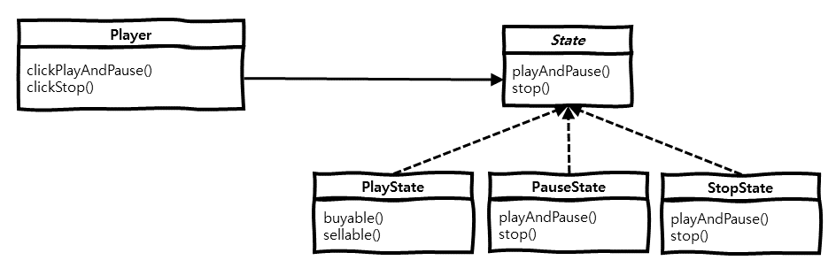

> 본 내용은 **Head First 디자인 패턴**(Eric Freeman, Elisabeth Freeman, Kathy Sierra, Bert Bates 지음, 서환수 옮김)을 읽은 후, 생각을 정리한 내용입니다.  
> 보다 상세한 내용이 궁금하신 분은 해당 책을 읽어보는 것을 추천합니다. 

# 개요
스테이트 패턴(State Pattern)에 대해 알아보고, 구현 방법 및 예시에 대해 알아봅니다.

# 의도 (Intent)
 스테이트 패턴에서는 필요한 기능을 인터페이스로 만들고, 모든 상태를 캡슐화시켜서 해당 인터페이스를 구현하도록 만듭니다.  
스테이트 패턴을 사용하면 각 상태별 기능의 동작을 명확하게 분리할 수 있습니다.

# 동기 (Motivation)
 동영상 재생 플레이어를 만든다고 가정하겠습니다. 플레이어는 **재생/일시정지**, **정지** 2개의 버튼이 있으며, **재생**, **일시정지**, **정지**
3개의 상태가 있습니다.  
 **재생/일시정지** 버튼은 플레이 상태에 따라 동작하는 기능이 달라야합니다. **재생** 상태에서는 해당 버튼을 누를 때 **일시정지**가 되어야 하고,
 **일시정지** 상태에서는 해당 버튼을 누를 때 **재생** 상태가 되어야 합니다.

**재생/일시정지** 동작 함수에 `if`문을 통한 상태 분기에 따른 기능을 구현한다면, 향후 다른 상태 조건이 추가될 경우 **단일 책임의 원칙**
 위배에 따라 사이드 이팩트가 발생할 수 있으며, 새로운 상태 추가에 따른 확장성이 떨어집니다.

 해결 방법으로는 **재생/일시정지**, **정지** 기능 인터페이스를 만들고, 해당 인터페이스를 **재생**, **일시정지**, **정지** 상태에 따라 구현합니다.
향후, **빨리감기** 상태가 추가되고, 해당 상태에서 **재생/일시정지** 버튼을 누를 경우 **일시정지** 상태가 되는 요구사항을 가정하겠습니다.  
 기능 인터페이스를 구현하는 **빨리감기** 상태를 만들고, **재생/일시정지** 버튼 기능에 대해 구현하면 됩니다.

# 구조 (Structure)
 스테이트 패턴의 주요 구조는 다음과 같습니다.



- **State** 인터페이스 :  
  `playAndPause()` 메소드는 **재생/일시정지** 버튼 동작을 수행하고,  
  `stop()` 메소드는 **정지** 버튼 동작을 수행합니다.
- **PlayState** 클래스 :  
  `playAndPause()` 메소드는 **일시정지** 상태로 변경하고,  
  `stop()` 메소드는 **정지** 상태로 변경합니다.
- **PauseState** 클래스 :  
  `playAndPause()` 메소드는 **재생** 상태로 변경하고,  
  `stop()` 메소드는 **정지** 상태로 변경합니다.
- **StopState** 클래스 :  
  `playAndPause()` 메소드는 **재생** 상태로 변경하고,  
  `stop()` 메소드는 아무 동작을 수행하지 않습니다.
- **Player** 클래스 :  
  `clickPlayAndPause()` 메소드는 현재 상태에 따라 **State** 구현체의 `playAndPause()` 메소드를 수행하고,  
  `clickStop()` 메소드는 현재 상태에 따라 **State** 구현체의 `stop()` 메소드를 수행합니다.

# 예제 (Example)
스테이트 패턴의 예제입니다.

```java
public interface State {

  void playAndPause();

  void stop();

}


public class PlayState implements State {

  private final Player player;

  public PlayState(Player player) {
    this.player = player;
  }

  @Override
  public void playAndPause() {
    // 일시정지 상태로 변경
    this.player.changePauseState();
  }

  @Override
  public void stop() {
    // 정지 상태로 변경
    this.player.changeStopState();
  }

}


public class PauseState implements State {

  private final Player player;

  public PauseState(Player player) {
    this.player = player;
  }

  @Override
  public void playAndPause() {
    // 재생 상태로 변경
    this.player.changePlayState();
  }

  @Override
  public void stop() {
    // 정지 상태로 변경
    this.player.changeStopState();
  }

}


public class StopState implements State {

  private final Player player;

  public StopState(Player player) {
    this.player = player;
  }

  @Override
  public void playAndPause() {
    // 재생 상태로 변경
    this.player.changePlayState();
  }

  @Override
  public void stop() {
    // 아무 동작도 하지 않음
  }

}
```

 플레이어의 기능 인터페이스 `State`를 각 상태별로 구현한 `PlayState`, `PauseState`, `StopState`를 구성합니다.

```java
public class Player {

  private State playState;
  private State pauseState;
  private State stopState;
  private State state;

  public Player() {
    this.playState = new PlayState(this);
    this.pauseState = new PauseState(this);
    this.stopState = new StopState(this);

    this.state = this.stopState;
  }

  public void clickPlayAndPause() {
    System.out.println("재생/일시정지 버튼 클릭");
    this.state.playAndPause();
  }

  public void clickStop() {
    System.out.println("정지 버튼 클릭");
    this.state.stop();
  }

  public void changePlayState() {
    System.out.println("상태변경 : 재생");
    this.state = playState;
  }

  public void changePauseState() {
    System.out.println("상태변경 : 일시정지");
    this.state = this.pauseState;
  }

  public void changeStopState() {
    System.out.println("상태변경 : 정지");
    this.state = this.stopState;
  }

}
```

 플레이어에서는 위에서 구현한 각 상태를 초기화하고, 현재 상태를 나타낼 `state` 변수를 초기값인 `StopState`로 초기화 합니다.

```java
public class Main {

  public static void main(String[] args) {
    Player player = new Player();

    // 재생
    player.clickPlayAndPause();

    // 일시정지
    player.clickPlayAndPause();

    // 재생
    player.clickPlayAndPause();

    // 정지
    player.clickStop();
  }

}
```

 플레이어를 초기화 하고, `clickPlayAndPause()`, `clickStop()` 메소드를 통해 플레이어를 컨트롤 합니다.

```
재생/일시정지 버튼 클릭
상태변경 : 재생
재생/일시정지 버튼 클릭
상태변경 : 일시정지
재생/일시정지 버튼 클릭
상태변경 : 재생
정지 버튼 클릭
상태변경 : 정지
```


# 줄이며...
 스테이트 패턴은 상태에 따른 `if` 분기를 통해 기능을 수행하는 것이 아닌 **단일 책임의 원칙**에 따라, 각 상태별 동작을 분리하는 패턴 
입니다. 이로써, 상태 및 기능 추가에 대한 유연한 확장성을 가져갈 수 있습니다.
