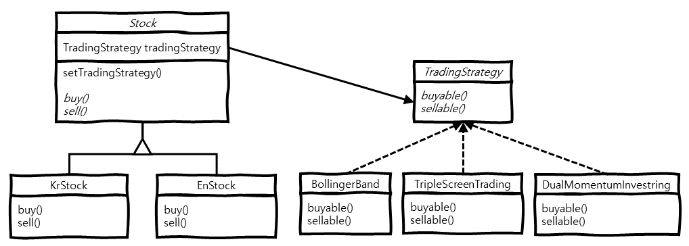

> 본 내용은 **Head First 디자인 패턴**(Eric Freeman, Elisabeth Freeman, Kathy Sierra, Bert Bates 지음, 서환수 옮김)을 읽은 후, 생각을 정리한 내용입니다.  
> 보다 상세한 내용이 궁금하신 분은 해당 책을 읽어보는 것을 추천합니다. 

# 개요
스트래티지 패턴(Strategy Pattern)에 대해 알아보고, 구현 방법 및 예시에 대해 알아봅니다.

# 의도 (Intent)
 스트래티지 패턴에서는 알고리즘군을 정의하고 각각을 캡슐화하여 교환해서 사용할 수 있도록 만듭니다.
스트래티지 패턴을 활용하면 알고리즘을 사용하는 클라이언트와는 독립적으로 알고리즘을 변경할 수 있습니다.  
 바뀌는 부분은 따로 뽑아서 캡슐화시킵니다. 그러면 나중에 바뀌지 않는 부분에는 영향을 미치지 않은 채로 원하는 부분만 고치거나
확장할 수 있습니다.

# 동기 (Motivation)
 주식 매매에 있어 기준이 되는 **트레이딩 전략**은 다양하게 있습니다. 이러한 전략에 따라 *매수*, *매도* 시점이 달라지게 되고,
트레이딩 전략은 언제든 쉽고 빠르게 교체할 수 있어야 합니다.

 만약, 주식 매매 책임을 맡은 `Stock` 내부에 트레이딩 전략을 구현 해놓아 강하게 결합이 되어있다면, 향후 다른 트레이딩 전략으로 변경하기
쉽지 않을 뿐더러, 트레이딩 전략 변경 중 `Stock` 클래스를 잘못 수정하여 또 다른 사이드이팩트를 야기할지도 모릅니다.

 해결 방법으로는 주식 매매 책임을 맡은 `Stock`과 다양한 트레이딩 전략을 따로 뽑아서 캡슐화시키는 것입니다.  
`Stock`은 캡슐화하여 뽑아낸 트레이딩 전략이 무슨 전략인지는 알지 못하고, 알 필요도 없으며 현재가 매수, 매도시점인지 여부만 전달 받고
그에 맞는 매매를 수행하게 됩니다.

# 구조 (Structure)
 스트래티지 패턴의 주요 구조는 다음과 같습니다.



- **Stock** 추상 클래스 :  
  `tradingStrategy` 맴버 변수는 `TradingStrategy` 인터페이스를 구현한 어떤 전략이든 할당이 가능하고,  
  `setTradingStrategy()` 메서드로 `tradingStrategy` 멤버 변수를 동적으로 변경할 수 있고,  
  `buy()`, `sell()` 추상 메서드가 있습니다.
- **KrStock**, **EnStock** 클래스 :  
  `buy()` 메서드 내부에서 `tradingStrategy.buyable()` 메서드를 통해 매수 동작을 조작하고,  
  `sell()` 메서드 내부에서 `tradingStrategy.sellable()` 메서드를 통해 매도 동작을 조작합니다.
- **TradingStrategy** 인터페이스 :  
  `buyable()` 메서드는 매수 가능 여부를 반환하고,  
  `sellable()` 메서드는 매도 가능 여부를 반환합니다.
- **BollingerBand**, **TripleScreenTrading** ... 클래스 :  
  트레이딩 전략에 따라 매수, 매도 시점을 알려주는 `buyable()`, `sellable()` 메서드를 구현합니다.

# 예제 (Example)
 스트래티지 패턴의 예제입니다.

```java
public abstract class Stock {

  protected TradingStrategy tradingStrategy;

  public void setTradingStrategy(TradingStrategy tradingStrategy) {
    this.tradingStrategy = tradingStrategy;
  }

  abstract void buy();

  abstract void sell();

}


public class KrStock extends Stock {

  @Override
  void buy() {
    if (this.tradingStrategy.buyable()) {
      // 한국 주식 매수
    }
  }

  @Override
  void sell() {
    if (this.tradingStrategy.sellable()) {
      // 한국 주식 매도
    }
  }

}


public class EnStock extends Stock {

  @Override
  void buy() {
    if (this.tradingStrategy.buyable()) {
      // 미국 주식 매수
    }
  }

  @Override
  void sell() {
    if (this.tradingStrategy.sellable()) {
      // 미국 주식 매도
    }
  }

}
```

```java
public interface TradingStrategy {

  boolean buyable();

  boolean sellable();

}


public class BollingerBand implements TradingStrategy {

  @Override
  public boolean buyable() {
    // ... 트레이딩 전략에 따른 boolean 반환
    return false;
  }

  @Override
  public boolean sellable() {
    // ... 트레이딩 전략에 따른 boolean 반환
    return false;
  }

}


public class TripleScreenTrading implements TradingStrategy {

  @Override
  public boolean buyable() {
    // ... 트레이딩 전략에 따른 boolean 반환
    return false;
  }

  @Override
  public boolean sellable() {
    // ... 트레이딩 전략에 따른 boolean 반환
    return false;
  }

}
```

```java
public class Main {

  public static void main(String[] args) {
    Stock stock = new KrStock();
    stock.setTradingStrategy(new BollingerBand());

    // Bollinger Band 전략에 따른, 한국 주식 매수
    stock.buy();

    // Bollinger Band 전략에 따른, 한국 주식 매도
    stock.sell();
  }

}
```

# 줄이며...
 스트래티지 패턴은 **디자인 원칙** 중 다음 세가지 원칙에 대해 초점을 맞춘 패턴입니다.  

1. 어플리케이션에서 달라지는 부분을 찾아내고, 달라지지 않는 부분으로부터 분리시킨다.  
2. 구현이 아닌 인터페이스에 맞춰서 프로그래밍한다.  
3. 상속보다는 구성을 활용한다.

이러한 디자인 원칙을 지켜냄으로써 주식 매매와 독립적으로 트레이딩 전략을 수정할 수 있게 되었습니다.
