# 개요
M1 맥북 구매 후 초기에 설정하면 편리한 기능들을 소개하고자 합니다.

# 요약
1. iCloud *데스크탑 및 문서 폴더* 연동 해제
2. 데스크탑 *스택 사용*
3. Dock 설정
   - *자동으로 Dock 가리기와 보기*
   - *Dock 크기 조절*
   - *Dock 반응 속도 조절*
   - *윈도우 최소화 효과*
4. 메뉴 막대 설정
   - 배터리 *퍼센트 보기*
5. Finder 설정
   - *경로 막대 보기*, *상태 막대 보기*
   - *폴더 우선 정렬*
   - *스크롤 막대 항상 보기*
6. 트랙패드 설정
   - *탭하여 클릭하기*
   - *클릭 가볍게*

---

# iCloud 데스크탑 및 문서 폴더 연동 해제
*시스템 환경설정* > *Apple ID* > *iCloud Drive*의 옵션 버튼 > *데스크탑 및 문 폴더* 체크 해제

> 데스크탑이 iCloud와 연동된 줄 모르고 사용하다 보면, 금방 용량이 꽉 찼다는 메시지가 뜹니다.  
> 연동이 꼭 필요한 경우에만 설정하는 것이 좋습니다.

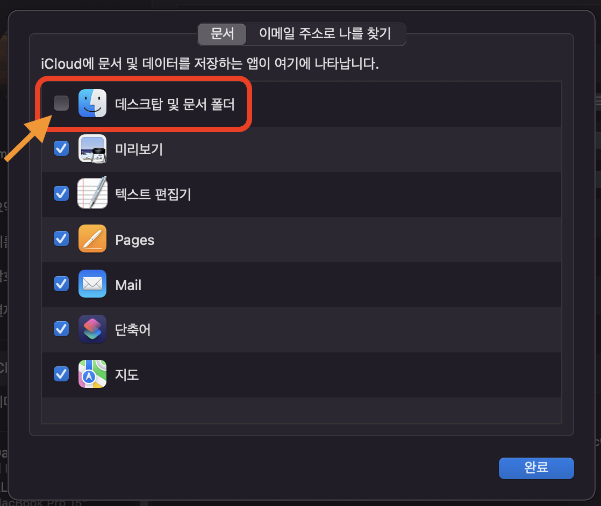

# 데스크탑 스택 사용
*데스크탑*에서 마우스 우클릭 > *스택 사용* 선택

> MacOS를 사용하다 보면 데스크탑에 수많은 아이콘이 쌓이게 됩니다.  
> 스택을 사용하면 비슷한 분류끼리 자동으로 묶어줘 깔끔하게 관리할 수 있습니다.

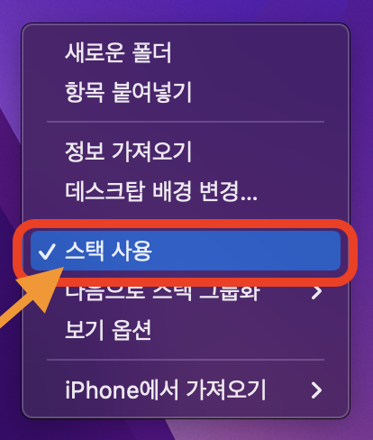

# Dock 설정

## 자동으로 Dock 가리기와 보기
*시스템 환경설정* > *Dock 및 메뉴 막대* > *자동으로 Dock 가리기와 보기* 체크

> Dock으로 화면이 가려지는 부분이 있습니다.  
> Dock을 숨겨 놓아 화면을 좀 더 넓게 사용할 수 있습니다.

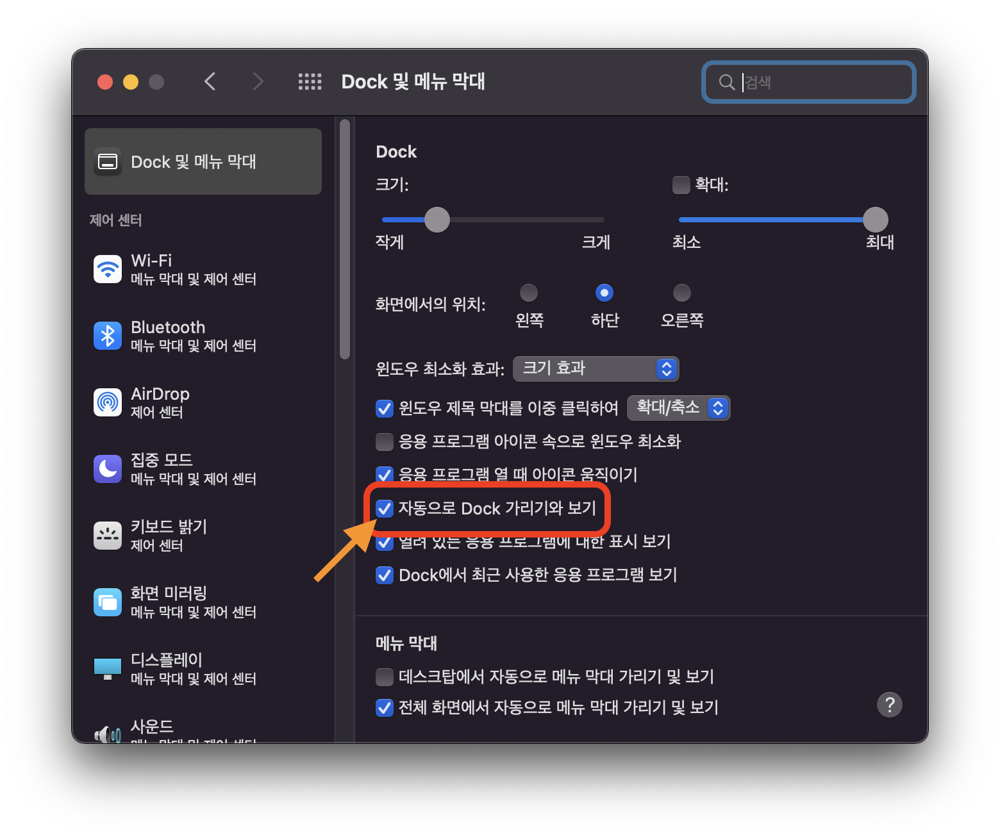

## Dock 크기 조절
*시스템 환경설정* > *Dock 및 메뉴 막대* > *Dock 크기* 조절

> Dock의 아이콘 크기를 조절해 깔끔하게 사용할 수 있습니다.


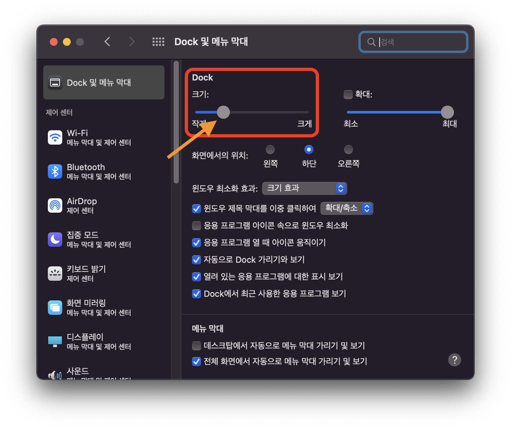

## Dock 반응 속도 조절
*터미널*에 접속해서 아래 명령어를 실행합니다.

```bash
$ defaults write com.apple.dock autohide-delay -float 0;killall Dock
```

> Dock을 자동으로 가렸을 때 포인터를 가져다 대면 Dock이 보입니다.
> 그런데 반응 속도가 빠릿빠릿하지 않습니다.  
> 이를 설정하면 Dock이 바로 응답해서 빠른 작업을 할 수 있습니다.

## 윈도우 최소화 효과
*시스템 환경설정* > *Dock 및 메뉴 막대* > *윈도우 최소화 효과* > *크기 효과* 선택

> 윈도우 최소화 효과를 크기 효과로 설정하면, 요술램프 지니 효과일 때보다
> 빠르고 깔끔하도록 적용할 수 있습니다.

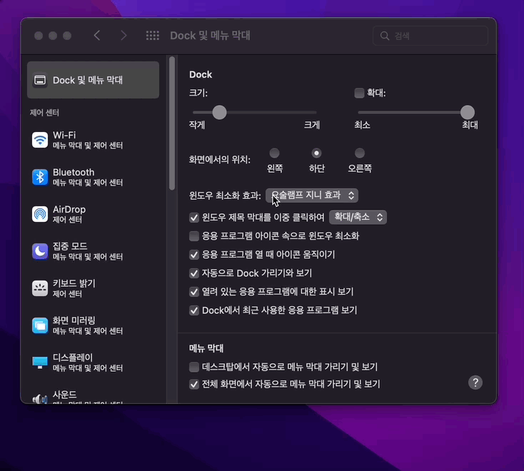

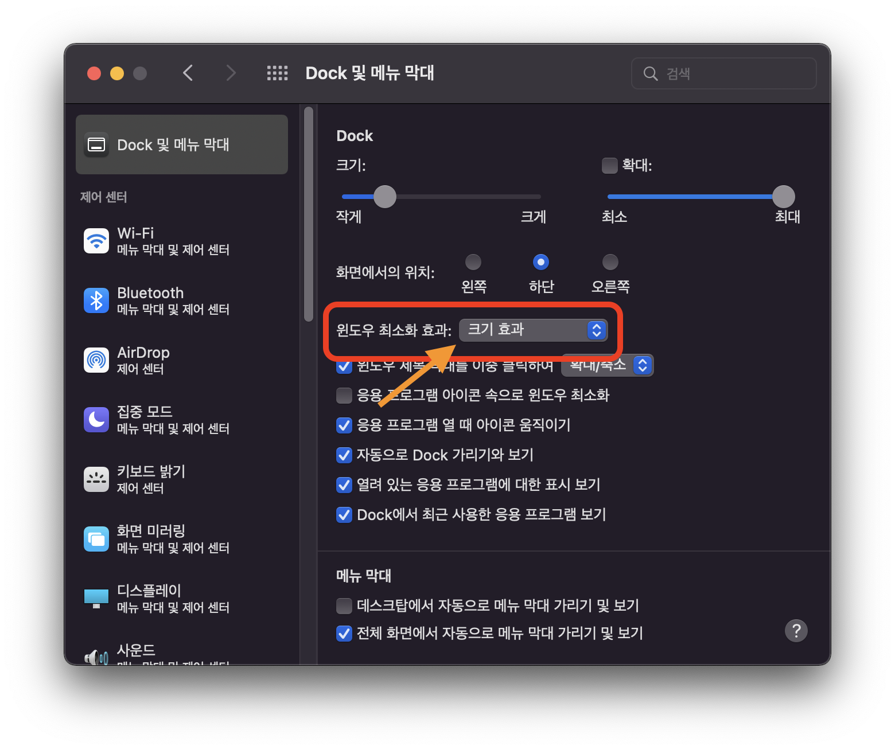

# 메뉴 막대 설정

## 배터리 퍼센트 보기
*시스템 환경설정* > *Dock 및 메뉴 막대* > 좌측 *배터리* 메뉴 > *퍼센트 보기* 체크

> 상단의 메뉴 막대에서 배터리 잔량을 퍼센트로 확인할 수 있어 편리합니다.

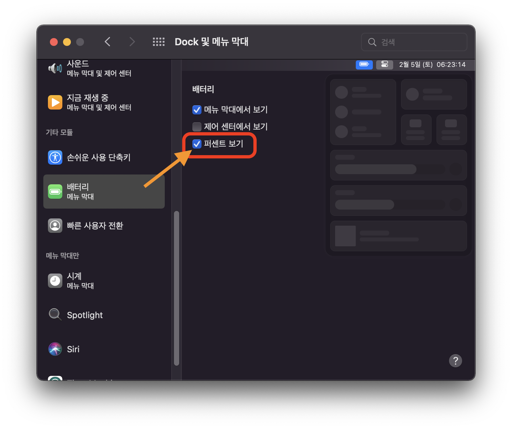

# Finder 설정

## 경로 막대 보기, 상태 막대 보기
*Finder* > 상단 메뉴 막대에서 *보기* 메뉴 > *경로 막대 보기* 선택  
*Finder* > 상단 메뉴 막대에서 *보기* 메뉴 > *상태 막대 보기* 선택

> Finder의 하단에서 현재 경로 정보와 용량 등의 상태 정보를 확인할 수 있어 편리합니다.

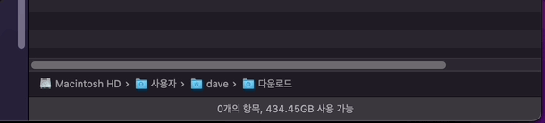

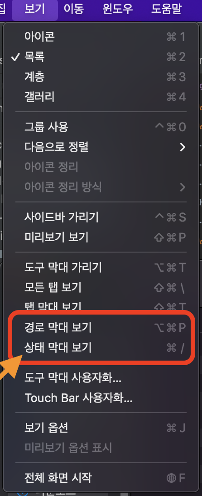

## 폴더 우선 정렬
*Finder 환경설정* > 폴더 우선 정렬의 *윈도우에서(이름순으로 정렬 시)* 체크

> 기본 정렬은 폴더와 파일이 뒤죽박죽 섞여서 정렬됩니다.  
> 폴더 우선 정렬을 설정하면 폴더와 파일이 나누어져 정렬되어 깔끔합니다.

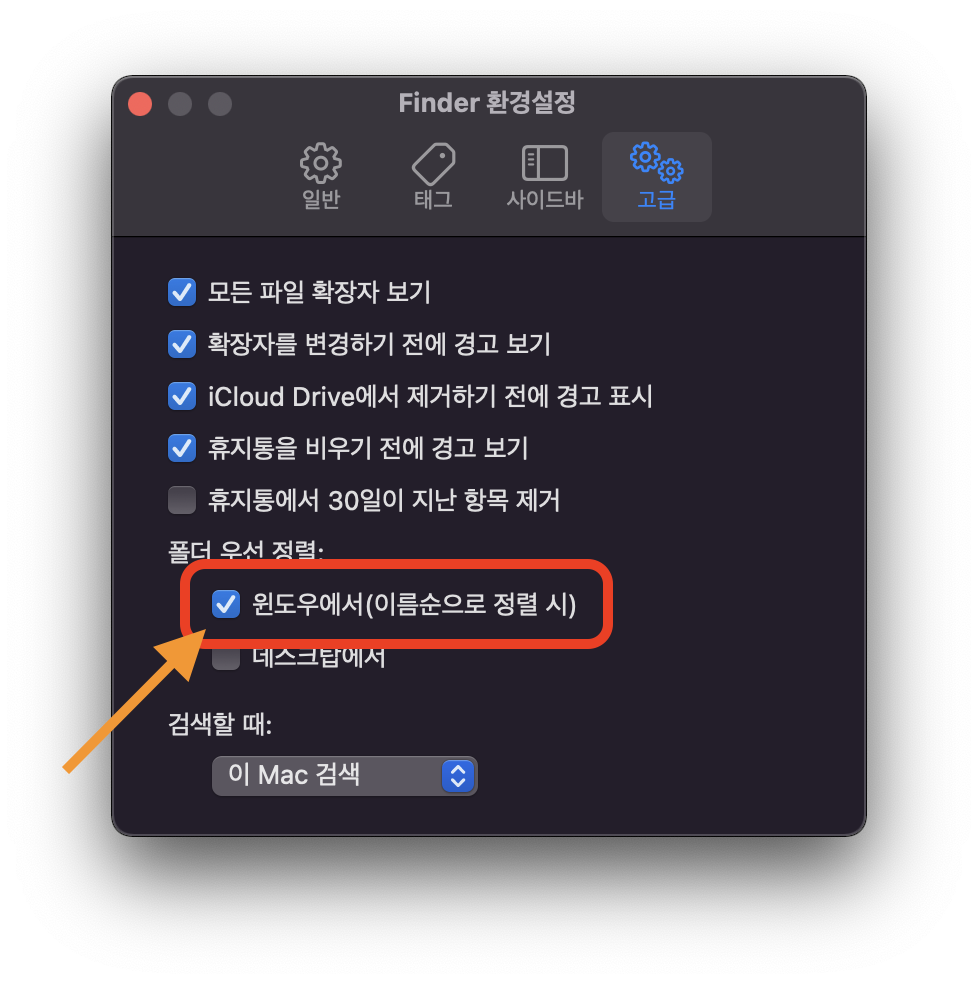

## 스크롤 막대 항상 보기
*시스템 환경설정* > *일반* > 스크롤 막대 보기의 *항상* 선택

> MacOS에서는 스크롤을 움직일 때만 스크롤 막대가 보입니다.  
> 스크롤 막대 항상 보기를 설정하면, Finder 안에 파일이 얼마나 남았는지
> 손쉽게 확인할 수 있습니다.

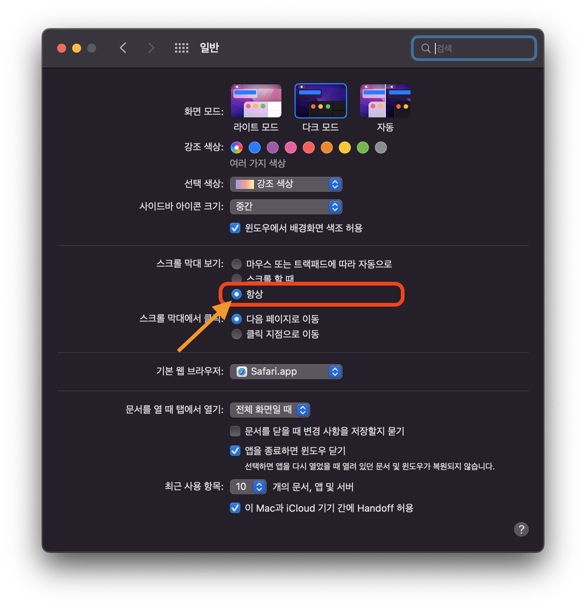

# 트랙패드 설정

## 탭하여 클릭하기
*시스템 환경설정* > *트랙패드* > *탭하여 클릭하기* 체크

> 트랙패드를 살짝 터치해서 편하게 클릭할 수 있습니다.

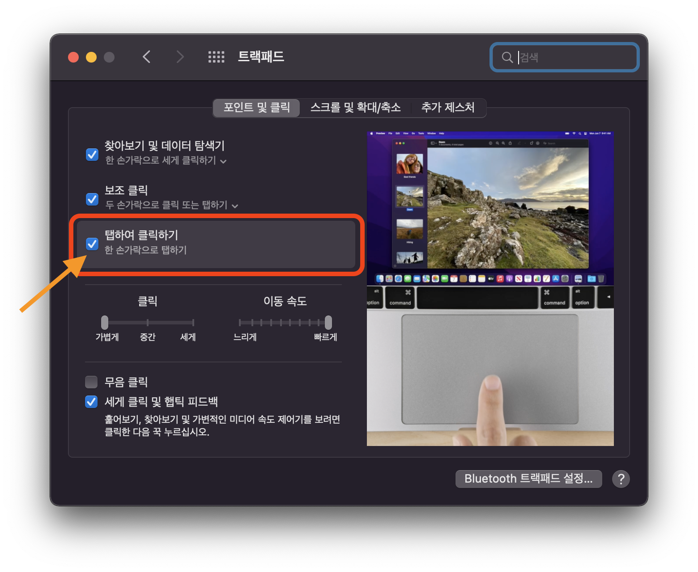

## 클릭 가볍게
*시스템 환경설정* > *트랙패드* > 클릭 *가볍게* 선택

> 트랙패드의 클릭 강도를 조절할 수 있습니다.  
> 클릭 강도를 가볍게 설정하면 장시간 사용 시 부담이 적어집니다.

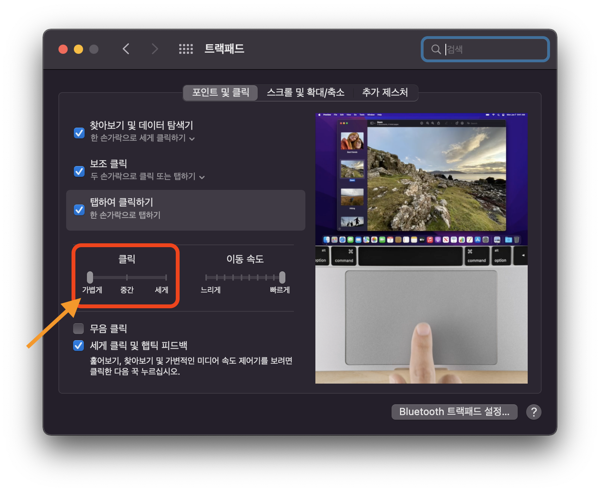

# 줄이며...
새로운 MacOS를 사용할 때, 평소에 당연하듯 사용하던 설정들이 빠져 불편했던 경험이 있습니다.  
이를 통해 또 다른 누군가의 시간이 절약되면 좋겠습니다!
