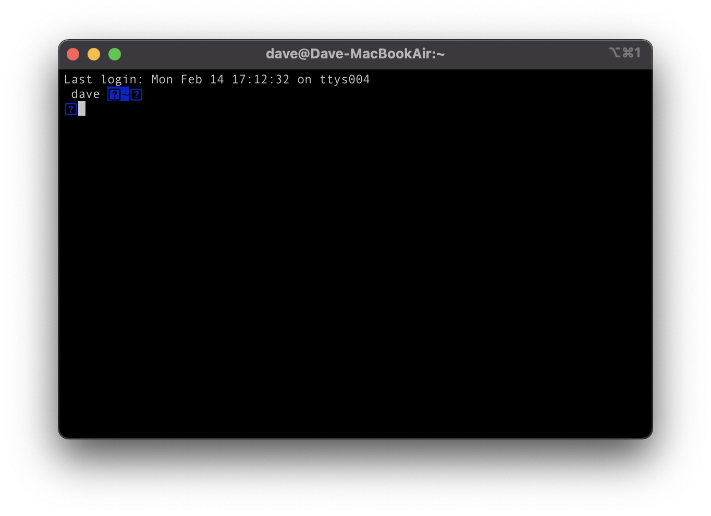

# 개요
M1 맥북 구매 후 생산성을 향상에 도움이 되는 꼭 설치해야 하는 유틸리티 7가지를 소개하고자 합니다.  

# 요약
1. Homebrew
2. iTerm2
3. Oh My ZSH
4. Rectangle
5. Alfred
6. Hidden Bar
7. GIPHY Capture

---

# Homebrew
| 라이센스 구분 |                                                                         |
|:-------:|:-----------------------------------------------------------------------:|
|  라이센스   | [BSD License](https://github.com/Homebrew/brew/blob/master/LICENSE.txt) |

[Homebrew](https://brew.sh/index_ko)는 패키지를 관리해주는 유틸리티로써,
손쉽게 패키지를 설치, 업데이트 및 제거를 할 수 있도록 해줍니다.

[Homebrew의 자세한 사용 방법](/development/etc/mac-os/install-homebrew)이 궁금하신 분은 링크를 통해 확인할 수 있습니다.

## 설치
다음 명령어 실행을 통해 설치할 수 있습니다.
```bash
$ /bin/bash -c "$(curl -fsSL https://raw.githubusercontent.com/Homebrew/install/HEAD/install.sh)"
```

# iTerm2
| 라이센스 구분 |                                                  |
|:-------:|:------------------------------------------------:|
|  라이센스   | [GPL v2 License](https://iterm2.com/license.txt) |

[iTerm2](https://iterm2.com)는 터미널을 대체할 수 있는 유틸리티로써,
기본 터미널보다 더 다양한 플러그인과 테마를 통해 수월한 개발을 할 수 있도록 해줍니다.

## 설치
다음 brew 명령어 실행을 통해 설치할 수 있습니다.
```bash
$ brew install --cask iterm2
```

## 설정
Finder의 경로에서 터미널을 바로 실행하고 싶을 수가 있습니다.

*시스템 환경설정* > *키보드* > *단축키* > *서비스* > *New iTerm2 Tab Here* 체크  
원하는 단축키를 등록한 후 Finder에서 단축키를 수행하면 iTerm이 해당 경로에서 열립니다.


# Oh My ZSH
| 라이센스 구분 |                                     써                                     |
|:-------:|:-------------------------------------------------------------------------:|
|  라이센스   | [MIT License](https://github.com/ohmyzsh/ohmyzsh/blob/master/LICENSE.txt) |

[Oh My ZSH](https://ohmyz.sh)는 ZSH의 테마를 꾸며주는 유틸리티로써,
손쉽게 테마를 꾸며 가독성을 높일 수 있도록 해줍니다.

## 설치
다음 brew 명령어 실행을 통해 설치할 수 있습니다.
```bash
$ sh -c "$(curl -fsSL https://raw.github.com/robbyrussell/oh-my-zsh/master/tools/install.sh)"
```

## 설정

### 테마 설정
iterm을 실행 후, **.zshrc** 파일에 테마를 지정합니다.
```bash
$ vim ~/.zshrc
```

11 번째 라인의 **ZSH_THEME** 값을 *agnoster*로 변경합니다.

변경 사항을 적용합니다.
```bash
$ source ~/.zshrc
```

### 한글 깨짐 설정


테마를 적용하면 위와 같이 한글이 깨지게 됩니다.
언어 깨짐을 해결하기 위해 [D2Coding](https://github.com/naver/d2codingfont) 폰트를
다운로드해 준비합니다.


1. `Cmd` + `,`를 눌러서 설정으로 들어갑니다.
2. 상단의 **Profiles** 메뉴를 누릅니다.
3. **Text** 탭을 누릅니다.
4. Unicode의 **Unicode normalization form** 값을 *NFC*로 설정합니다.
5. **Font** 값을 *D2Coding*으로 설정합니다.

# Rectangle
| 라이센스 구분 |                                                                          |
|:-------:|:------------------------------------------------------------------------:|
|  라이센스   | [MIT License](https://github.com/rxhanson/Rectangle/blob/master/LICENSE) |

[Rectangle](https://rectangleapp.com)은 윈도우를 관리해주는 유틸리티로써,
윈도우를 옮기거나 손쉽게 크기를 조정할 수 있도록 해줍니다.

Windows에서는 `윈도우키` + `방향키`로 윈도우를 왼쪽 맞춤, 오른쪽 맞춤, 전체화면 등 조절을 할 수 있지만,
MacOS에서는 해당 기능을 기본으로 제공하지 않습니다.  
Rectangle은 MacOS에서도 이를 가능하도록 도와줍니다.


## 설치
다음 brew 명령어 실행을 통해 설치할 수 있습니다.
```bash
$ brew install --cask rectangle
```

# Alfred
| 라이센스 구분 |                                                                          |
|:-------:|:------------------------------------------------------------------------:|
|  라이센스   | [MIT License](https://github.com/rxhanson/Rectangle/blob/master/LICENSE) |

[Alfred](https://www.alfredapp.com)는 Spotlight보다 확장된 기능을 제공하는 유틸리티로써,
프로그램의 특정 기능을 바로 실행하거나, 빠르게 포탈 검색을 할 수 있도록 해줍니다.

## 설치
다음 brew 명령어 실행을 통해 설치할 수 있습니다.
```bash
$ brew install --cask alfred
```

## 설정

### Hotkey 설정
Spotlight 단축키를 Alfred로 대체합니다.

**시스템 환경설정** > **키보드** > **단축키** 탭 선택 > **Spotlight** 메뉴 선택 > *Spotlight 검색 보기*, *Finder 검색 윈도우 보기* 체크 해제


**Alfred 환경설정** > **General** 메뉴 선택 > **Alfred Hotkey**를 `Cmd` + `Space`로 변경


### Web 검색 설정
원하는 포탈에서 바로 검색하도록 설정할 수 있습니다.

**Alfred 환경설정** > **Features** 메뉴 선택 > **Web Search** 탭 선택 > **Add Custom Search** 버튼 선택


다음을 원하는 값으로 채웁니다.  
*Search URL*은 아래에서 희망하는 URL로 설정합니다.  
*Title*은 자신이 알아볼 수 있는 이름으로 설정합니다.  
*Keyword*는 Alfred를 통해 검색 시 실행할 단어를 설정합니다.

* 네이버 검색 URL  
  `https://search.naver.com/search.naver?query={query}`
* 네이버 지도 URL  
  `https://map.naver.com/?query={query}`
* 네이버 쇼핑 URL  
  `https://search.shopping.naver.com/search/all.nhn?query={query}`
* 다음 검색 URL  
  `https://search.daum.net/search?q={query}`
* 카카오 지도 URL  
  `https://map.kakao.com/?q={query}`
* 구글은 그냥 검색해도 됩니다.

검색은 Alfred에서 `{Keyword} {검색어}`를 입력해서 검색할 수 있습니다.


# Hidden Bar
| 라이센스 구분 |                                                                        |
|:-------:|:----------------------------------------------------------------------:|
|  라이센스   | [MIT License](https://github.com/dwarvesf/hidden/blob/develop/LICENSE) |

[Hidden Bar](https://github.com/dwarvesf/hidden)는 메뉴 막대의 자주 사용하지 않는 프로그램을 보이지 않도록 숨겨서
메뉴 막대를 깔끔하게 관리할 수 있도록 해줍니다.


## 설치
다음 brew 명령어 실행을 통해 설치할 수 있습니다.
```bash
$ brew install --cask hiddenbar
```

# GIPHY Capture
| 라이센스 구분 |           |
|:-------:|:---------:|
|  라이센스   | Free ware |

[GIPHY Capture](https://giphy.com/apps/giphycapture)는 gif 파일을 생성해주는 유틸리티로써,
블로그 등에서 예시 영상을 gif 파일로 만들 수 있도록 해줍니다.

## 설치
[GIPHY Capture 다운로드](https://apps.apple.com/us/app/giphy-capture-the-gif-maker/id668208984?mt=12)를
통해 설치할 수 있습니다.

## 설정
GIPHY Capture에 화면 기록 권한을 설정해야 촬영한 영상이 정상적으로 저장됩니다.  
*시스템 환경설정* > *보안 및 개인 정보 보호* > *개인 정보 보호* > *화면 기록* > *GIPHY CAPTURE* 체크


# 줄이며...
제가 사용하며 생산성을 크게 키워주는 유틸리티를 소개해보았습니다.  
이를 통해 또 다른 누군가의 생산성이 향상되면 좋겠습니다!
