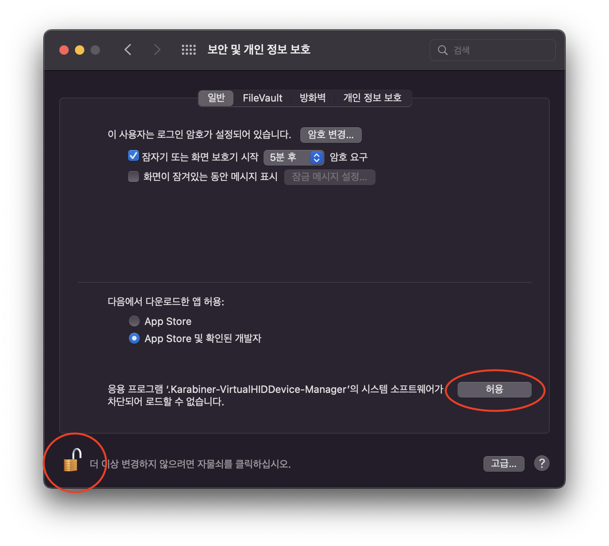
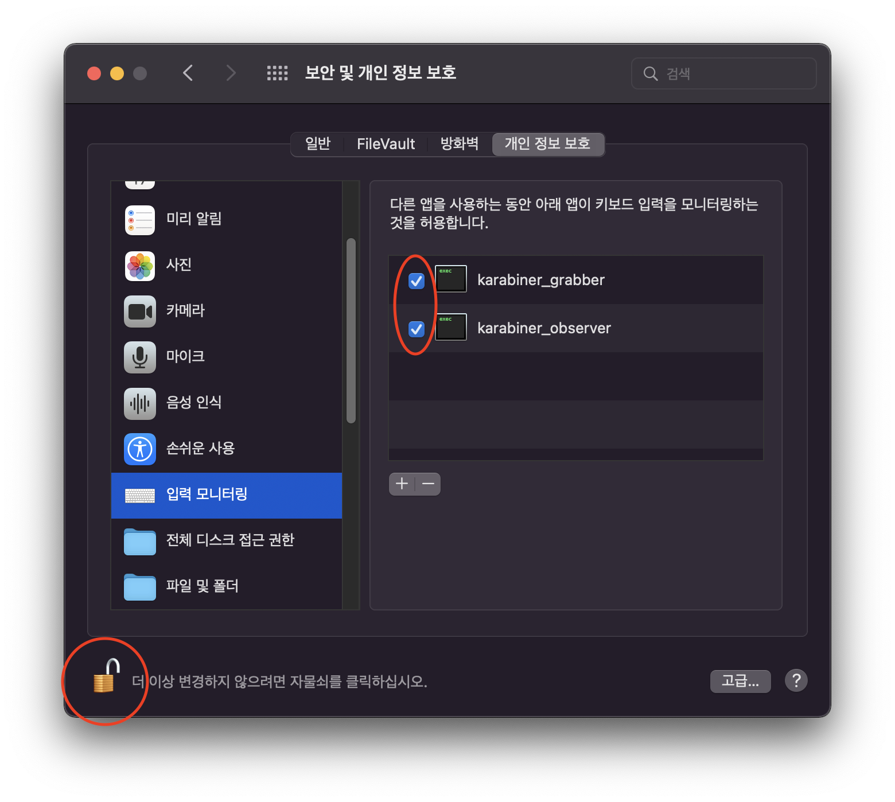
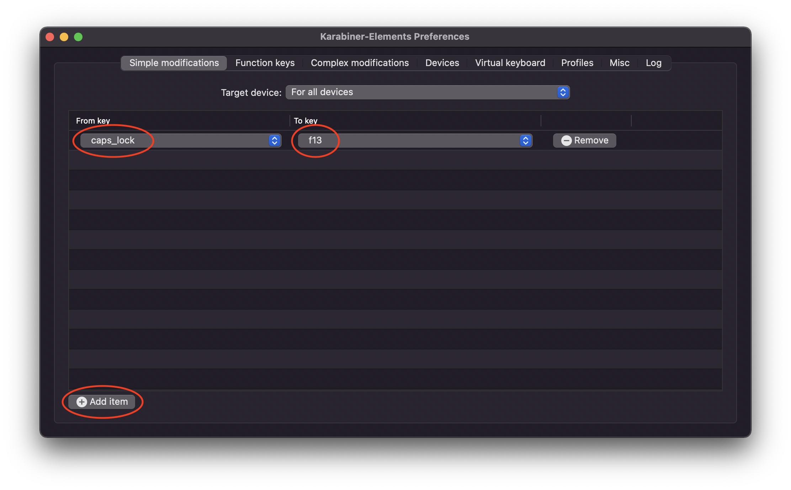
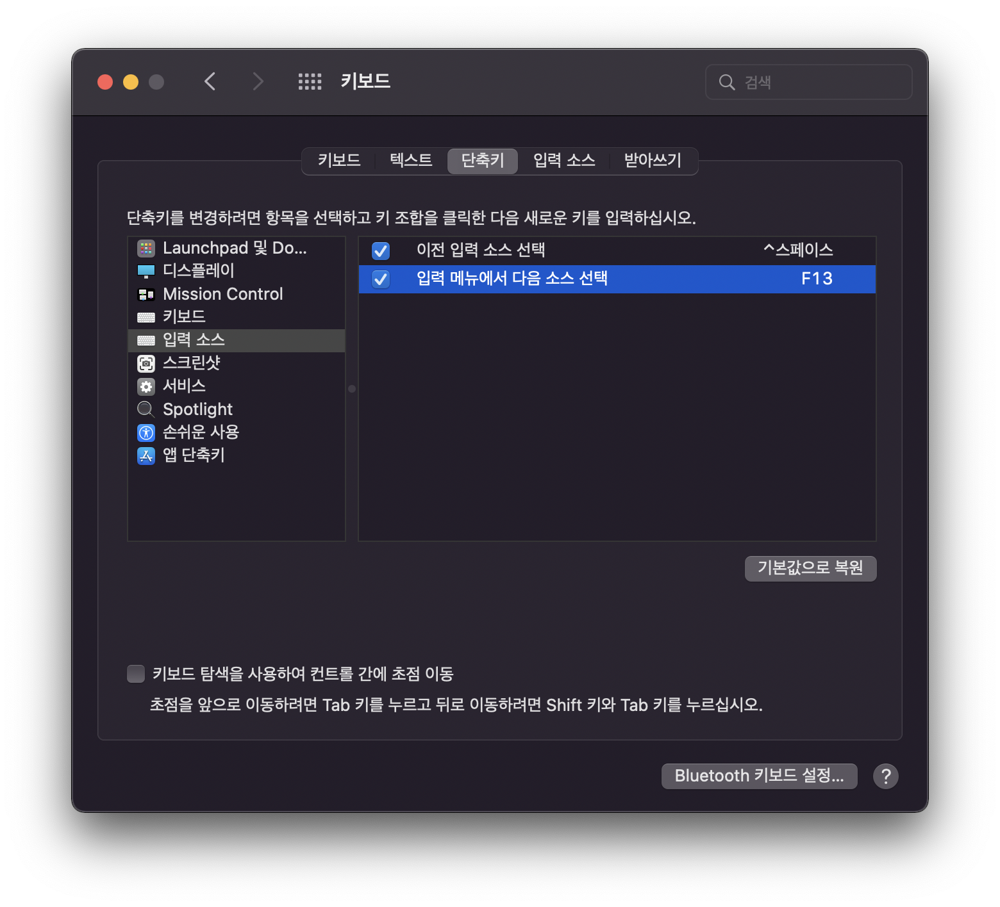

# 개요
MacOS에서 문서 작업중 한/영 전환이 빠릿빠릿하게 전환이 되지 않아 몇번씩 누르던 경험이 있습니다.  
이 포스팅에서는 저와 같이 참다 참다 폭발한 여러분께 손쉬운 해결 방법에 대해 소개하고자 합니다.

---

# 원인
왜 모든 기능이 빠른 MacOS에서 CapsLock을 통한 한/영 전환시 딜레이가 있을까요?  
원인은 CapsLock을 길게 누를 경우 대문자 고정 기능 때문입니다. 
CapsLock을 길게 누르는지 짧게 누르는지 판단하는 기능 때문에 간혹 한/영 전환이 빠릿하지 않았던 것 입니다.

이를 해결하는 방법에 대해 알아보겠습니다.

# Karabiner 설치
Karabiner는 키보드 매핑을 변경해주는 프로그램입니다.  
다음 명령어를 통해 Karabiner를 설치해줍니다.

```bash
$ brew install --cask karabiner-elements
```

> `brew`가 설치되어 있다는 가정하에 진행하겠습니다. 아직 설치하지 않은 분은 [brew 설치](/development/etc/install-brew)를 참고해주세요.

# Karabiner 설정
Karabiner는 키보드 입력값을 변경할 수 있는 만큼, MacOS에서 설정 하려면 여러 인증 과정을 거쳐야 합니다.  

## Karabiner 실행
Spotlight를 사용해 Karabiner-Elements를 실행합니다.

Spotlight는 `cmd` + `space` 단축키로 빠르게 실행하고, **Karabiner-Elements**를 입력해서 실행합니다.

## Karabiner 활성화
Karabiner를 실행하면 이를 활성화 할지 묻습니다.  
확인을 눌러줍니다.


차단된 Karabiner를 로드하기 위해, `시스템 환경설정` > `보안 및 개인 정보 보호` 의 `일반` 탭으로 이동해서, Karabiner를 허용해줍니다.  
만약, 허용 버튼이 활성화 되지 않았다면, 좌측 하단의 자물쇠를 누르고 인증해줍니다.



Karabiner의 키보드 접근을 허용하기 위해, `시스템 환경설정` > `보안 및 개인 정보 보호` 의 `개인 정보 보호` 탭으로 이동해서
`입력 모니터링` 메뉴를 누르고 *karabiner_grabber*, *karabiner_observer*를 체크해줍니다.  
만약, 체크박스가 활성화 되지 않았다면, 좌측 하단의 자물쇠를 누르고 인증해줍니다.



## CapsLock 키 변경
Karabiner에서 `Simple modifications` 탭에서 `Add item` 버튼을 눌러 *From key*와 *To Key*를 **caps_lock**과 **f13**으로 변경해줍니다.



# 키보드 단축키 설정
MacOS의 키보드의 한/영 전환 단축키를 Karabiner에서 설저한 단축키로 변경합니다.

## 키보드 단축키 변경
`시스템 환경설정` > `키보드` 의 `단축키` 탭으로 이동해서
`입력 소스` 메뉴를 누르고 **입력 메뉴에서 다음 소스 선택** 단축키를 **F13**으로 변경해줍니다.



이제 CapsLock의 빠릿빠릿한 한/영 전환을 경험하실 수 있습니다!  
더 이상 한/영 전환이 되지 않아 여러번 누르는 불편함 없이 MacOS를 사용하세요! :)
