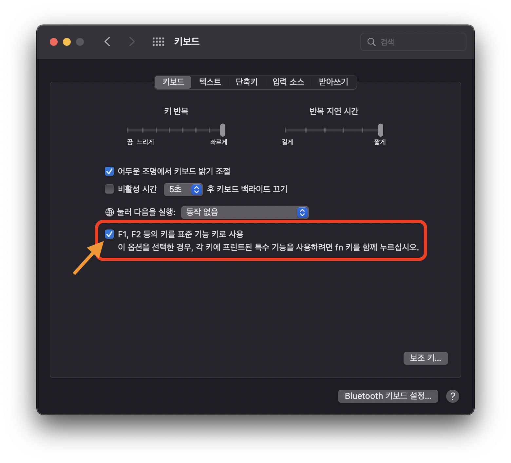

# 개요
 이 포스팅에서는 MacOS에서 fn 키를 누르지 않고 F1 ~ F12 키를 사용하는 방법에 대해 소개하고자 합니다.

# 요약
 1. Apple 메뉴 > 시스템 환경설정을 선택합니다.
 2. '키보드'를 클릭합니다.
 3. 'F1, F2 등의 키를 표준 기능 키로 사용'을 체크합니다.

---

# fn 키 누르지 않고 F1 ~ F12 키 사용하기
 기본적으로 Apple 키보드의 맨 윗줄에 있는 키는 Mac의 다양한 기능을 제어합니다.
예를 들어 **스피커 아이콘**이 있는 키를 누르면 *음량을 조절*할 수 있습니다.  
반대로, 표준 기능 키를 사용하려면 fn 키를 누른 상태에서 특정 기능 키를 누르면 됩니다.
예를 들어, **fn 키와 F12(스피커 아이콘) 키**를 함께 누르면 스피커 음량을 높이는 대신 *F12 키*에 지정된 작업이 수행됩니다.

 개인적으로 **음량 조절** 이나 **화면 밝기 조절** 보다 *표준 기능 키*의 사용 빈도가 높아 이를 반전해서 사용합니다.
저와 같은 상황의 경우 **기능 키 반전 사용**을 추천합니다.

## 설정 방법
 1. Apple 메뉴 > 시스템 환경설정을 선택합니다.
 2. '키보드'를 클릭합니다.
 3. 'F1, F2 등의 키를 표준 기능 키로 사용'을 체크합니다.

