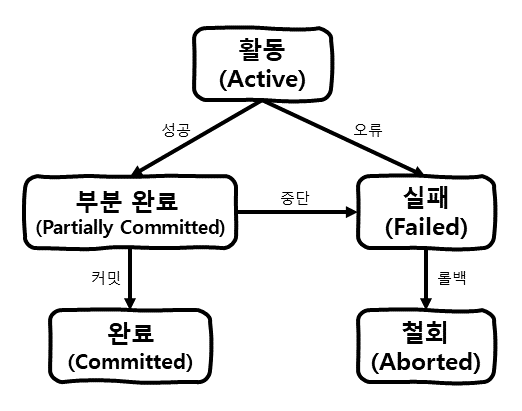

# 개요
이 포스팅에서는 DB의 트랜잭션(Transaction)의 특성 및 연산의 종류와 그에 따른 상태에 대해 알아보겠습니다.

# 트랜잭션이란?
DB의 트랜잭션에 대해 알아보도록 하겠습니다.
- DBMS(Database Management System)의 데이터를 다루는 논리적인 작업의 단위이다.
- DB의 데이터를 다루는 중 장애가 발생할 경우 데이터를 복구하는 작업의 단위이다.
- DB에서 여러 작업이 동시에 동일한 데이터를 다룰 때 작업을 구분하는 단위이다.
- 트랜젝션에 포함된 작업은 전체가 수행되거나, 또는 전혀 수행되지 않아야 한다.

위와 같은 트랜잭션은 왜 필요할까요?  
게임에서 플레이어 P가 아이템 I를 구매하는 로직을 수행하는 경우를 예로 들어보면 다음과 같은 순서로 로직이 진행 될 것입니다.  
1. 플레이어 P가 아이템 I를 구매할 돈이 충분한지 확인합니다.  
2. 플레이어 P의 보유 금액에서 아이템 I의 금액만큼 뺍니다.  
3. 플레이어 P에게 아이템 I를 할당합니다.

이 경우 (1) ~ (2) 로직을 정상 수행 후, (3) 로직을 수행하다 오류가 발생했다고 가정하겠습니다.
그러면 플레이어 P는 보유 금액은 차감되었으나, 아이템은 얻지 못한 상태가 됩니다.  
이렇게 하나의 논리적인 작업을 진행 시, **전체가 수행(금액 차감, 아이템 할당) 되거나 또는
전혀 수행되지 않아야(금액 차감 안됨, 아이템 할당 안됨)** 합니다.  
이러한 ***논리적인 작업의 단위를 하나의 트랜잭션***이라 합니다.

# 트랜잭션 특성 (ACID)
위에서 알아본 트랜잭션의 4가지 특성(ACID)에 대해 알아보도록 하겠습니다.
- 원자성 (**A**tomicity)
- 일관성 (**C**onsistency)
- 독립성 (**I**solation)
- 지속성 (**D**urability)

## 1. 원자성 (Atomicity)
**트랜잭션과 관련된 작업들이 부분적으로 실행되다가 중단되지 않는 것을 보장하는 것**입니다.  
즉, 위의 예시와 같이 플레이어의 보유 금액은 차감되고, 아이템은 얻지 못한 상태로 남는 일이 없도록 보장하는 것입니다.
그렇기에 트랜잭션 내의 모든 명령은 반드시 완벽히 수행되어야 하며, 모두가 완벽히 수행되지 않고 어느하나라도 오류가 발생하면 트랜잭션
전부가 취소되어야 합니다.

## 2. 일관성 (Consistency)
**트랜잭션이 성공적으로 완료되면 일관적인 DB상태를 유지해야 하는 것**입니다.  
즉, 트랜잭션이 완료 후 무결성 제약조건이 깨지거나, 데이터 타입이 정수형(Integer)에서 문자열(String) 으로 변경되지 않는 것입니다.

## 3. 독립성 (Isolation)
**트랜잭션 수행 중 다른 트랜잭션의 작업이 끼어들지 못하는 것**입니다.  
즉, 트랜잭션 밖에서는 트랜잭션 내의 연산 중간 단계의 데이터를 볼 수 없는 것입니다.

## 4. 지속성 (Durability)
**성공적으로 완료된 트랜잭션의 결과는 영구적으로 반영되어야 하는 것**입니다.  
즉, 커밋(Commit)을 하면 로그를 남기고 그 결과는 완전히 반영되는 것입니다. 또한, 로그를 이용해서 트랜잭션 수행전 상태로 되돌릴 수 있습니다.

# 트랜잭션 연산
트랜잭션의 연산에 대해 알아보도록 하겠습니다.  
일반적으로 쿼리를 날리면 DB에 바로 반영이 된다고 생각하기 쉬운데, DB에 반영되는 시점은 **트랜잭션 연산이 성공적으로 완료**되는 시점에
실제 DB에 반영이 됩니다. 그리고 트랜잭션의 연산에는 크게 두 가지 **커밋(Commit)**, **롤백(Rollback)** 과정이 있습니다.

## 커밋(Commit) 연산
**커밋 연산은 트랜잭션이 성공적으로 완료되었음을 선언하는 것**입니다.  
커밋 시 트랜잭션의 특성인 일관성과 지속성에 의해, 로그를 남기고 그 결과가 DB에 일관적인 상태로 영구 반영됩니다.

## 롤백(Rollback) 연산
**롤백 연산은 트랜잭션이 완벽히 수행되지 않고 실패했음을 선언하는 것**입니다.  
롤백 시 트랜잭션의 특성인 원자성에 의해, 현재 트랜잭션에서 지금까지 수행된 연산이 취소되고 이전 상태로 돌아가게 됩니다.

# 트랜잭션 상태
트랜잭션은 연산을 수행할 때, 다음과 같이 크게 5가지 상태가 존재합니다.

- 활동 (Active)  
  : 트랜잭션이 수행을 시작하여 실행중인 상태
- 부분 완료 (Partially Committed)  
  : 트랜잭션의 마지막 까지의 연산을 실행하고, 커밋을 하지 않아 DB에 반영하지 않은 상태
- 완료 (Committed)  
  : 트랜잭션이 성공적으로 완료되어 커밋을 실행한 상태
- 실패 (Failed)  
  : 오류가 발생해서 트랜잭션의 수행이 중단되고, 롤백을 하지 않은 상태
- 철회 (Aborted)  
  : 트랜잭션이 실패되어 롤백을 실행한 상태

# 줄이며...
지금까지 트랜잭션이 무엇인지 그리고 트랜잭션의 특성, 연산의 종류, 상태에 대해 알아보았습니다.  
이와 같은 트랜잭션 덕분에 DB가 항상 정확하고 일관된 상태를 유지할 수 있습니다. 
