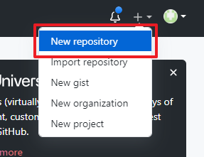
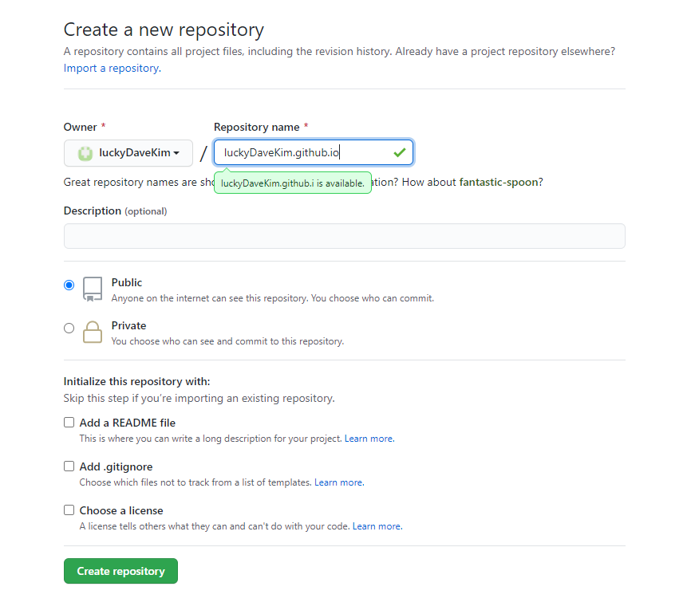

# 개요
[지난 포스팅](/development/front-end/install-gatsby-1)에서는 Gatsby를 알아보고, 정적 페이지를 생성해 보았습니다.  
이번 포스팅에서는 GitHub Pages를 생성하고, Gatsby로 생성한 홈페이지를 GitHub Pages에 올리는 방법에 대해 소개하고자 합니다.

# GitHub Pages란 무엇인가?
GitHub Pages는 GitHub 저장소의 내용을 무료로! 호스팅해주는 서비스입니다.  
지금 보시는 이 블로그 또한 GitHub Pages 서비스를 이용하고 있으며, 기본으로 제공되는 도메인은 `https://{user-name}.github.io` 와 같은 형태를 갖습니다. 물론 설정을 통해 별도의 도메인으로 변경할 수 있습니다.  

블로그를 제공하는 여러 다른 서비스들이 있습니다. 예를들면, 네이버 블로그, 카카오 티스토리 등이 있습니다.  
그렇다면 다른 블로그 서비스가 아닌 GitHub Pages를 사용하는 이유는 무엇일까요?  
네이버 블로그와 카카오 티스토리 같은 경우 누구나 쉽게 블로그를 설정하고 꾸밀 수 있지만, 정해진 틀 내에서만 꾸밀 수 있다는 제약사항이 있습니다.  
GitHub Pages 같은 경우 초기 진입장벽이 다른 블로그 서비스보다 높은 편이지만, 그만큼 무궁무진한 자유도를 갖습니다.  
또한, 저와 같이 Gatsby를 학습하며 동시에 블로그를 꾸밀 수 있는 일석이조의 효과를 갖을수도 있다는 점이 장점으로 들 수 있겠습니다.

# GitHub Pages를 구축해보자!
GitHub Pages를 구축하는 방법에 대해서는 [GitHub Pages 생성하는 방법](https://pages.github.com/)을 보면 잘 나와있습니다.  
함께 살펴보자면 우선 `{user-name}.github.io` 이름의 저장소를 생성 하면 끝입니다~!  
이후 `https://{user-name}.github.io`로 접속해보시면 저장소의 `README.md` 또는 `index.html`의 내용이 출력됨을 확인하실 수 있습니다.  

## 사용자 페이지와 프로젝트 페이지
위와같이 자신의 GitHub ID를 기반으로 생성하는 GitHub Pages를 `사용자 페이지`라고 하며, 이와 다른 `프로젝트 페이지`가 있습니다.

### 사용자 페이지
사용자 페이지는 계정별 단 하나만 생성이 가능하며, 다음과 같은 특징을 갖습니다.
- 저장소의 이름은 `{user-name}.github.io`의 구조로 단 하나만 생성 가능합니다.
- GitHub Pages에 반영되는 브랜치는 `master` 브랜치의 내용이 반영됩니다.
- GitHub Pages 접속 url은 `https://{user-name}.github.io` 입니다.

> `luckyDaveKim` GitHub 계정을 갖은 사용자가 `new-luckyDaveKim.github.io` 저장소를 생성하더라도 해당 정보의 GitHub Pages는 생성되지 않습니다.

### 프로젝트 페이지
프로젝트 페이지는 여러개 생성이 가능하며, 다음과 같은 특징을 갖습니다.
- 저장소의 이름에 제한이 없습니다.
- GitHub Pages에 반영되는 브랜치는 `gh-pages` 브랜치의 내용이 반영됩니다.
- GitHub Pages 접속 url은 `https://{user-name}.github.io/{project-name}` 형식의 사용자 페이지의 서브 url 입니다.

# Gatsby 홈페이지 배포하기!
Gatsby로 생성한 정적 홈페이지를 GitHub Pages에 배포하는 방법을 알아보겠습니다.  
여기서는 위에서 알아본 GitHub Pages의 사용자 페이지와 프로젝트 페이지 중 사용자 페이지를 통해 배포하는 방법을 살펴보도록 하겠습니다.  

1. `{user-name}.github.io` 저장소를 생성합니다.  
1-1. [GitHub](github.com) 페이지에 접속 후 우측 상단의 `+` 버튼을 클릭 후 `New repository`를 클릭합니다.  

1-2. Repository name에 계정 이름을 포함한 `{user-name}.github.io` 형식으로 입력합니다.  


2. 새로 생성한 저장소를 로컬에 clone 합니다.  
2-1. `https://github.com/{user-name}/{user-name}.github.io` 으로 이동하여 새로 생성한 저장소를 확인합니다.  
2-2. 우측의 `Code`를 클릭하여 repository 주소를 복사합니다.  

2-3. 새로 생성한 저장소를 로컬에 clone 합니다.  
```bash
> cd /
> git clone {repository-url}
> cd {user-name}.github.io
```

3. Gatsby 빌드 파일을 push 합니다.  
3-1. [지난 포스팅](/development/front-end/install-gatsby-1)에서 생성한 Gatsby 소스에서 `gatsby build` 명령어를 실행 후 생성된 public 디렉토리 내부 파일들을 모두 복사해옵니다.  
3-2. Gatsby build를 통해 가져온 파일을 커밋합니다.  
```bash
> git add .
> git commit -m 'init'
```
3-3. 커밋한 내용을 원격 저장소에 push 합니다.  
```bash
> git push origin master
```
3-4. 잠시후 GitHub Pages `https://{user-name}.github.io` 에 접속해보면 Gatsby로 build한 웹페이지가 나타나는 것을 확인 할 수 있습니다.  

# 줄이며...
지금까지 GitHub Pages가 무엇이고, 사용자 페이지와 프로젝트 페이지의 차이점을 알아보고 GitHub Pages를 생성 및 배포하는 방법에 대해 알아보았습니다.
다음에는 Travis CI를 통해 자동 배포하는 방법에 대해 알아보겠습니다.
