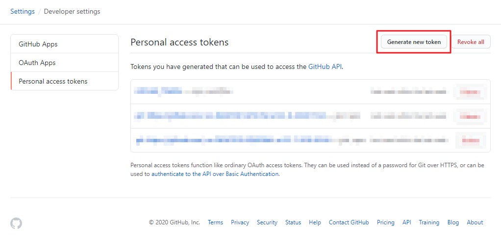
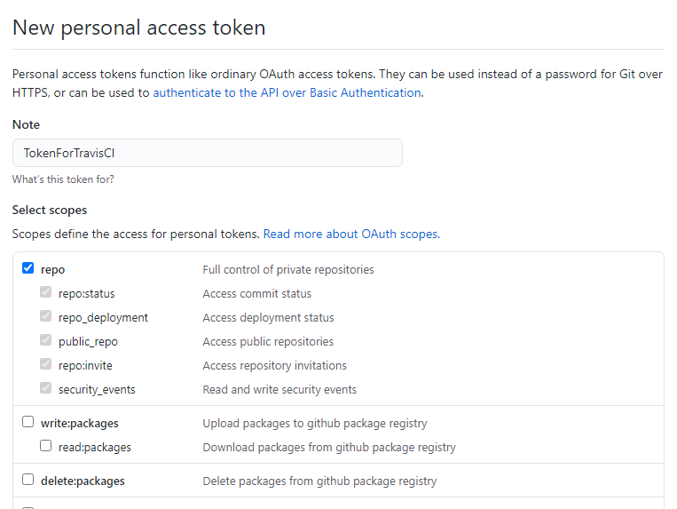
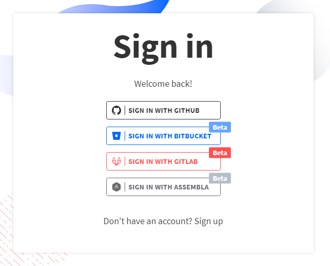
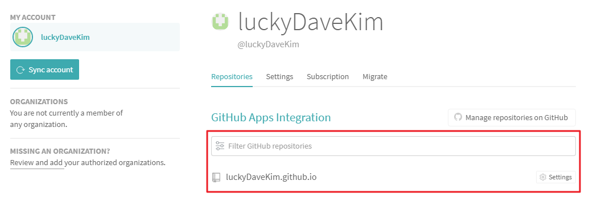
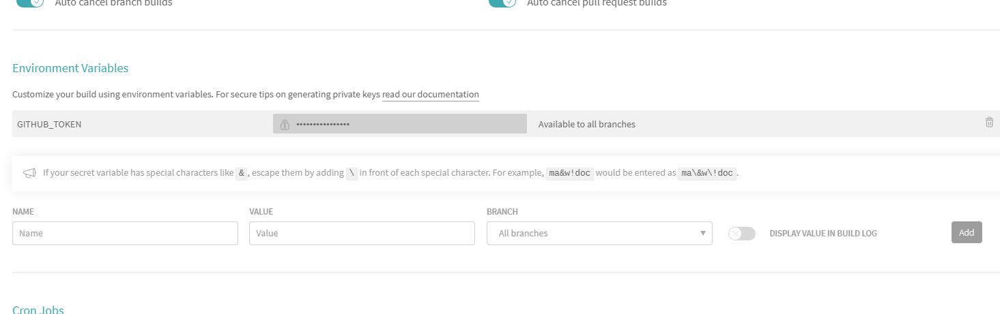

# 개요
[지난 포스팅](/development/front-end/install-gatsby-2)에서는 GitHub Pages를 알아보고, 나만의 홈페이지를 생성해 보았습니다.  
이번 포스팅에서는 Travis CI를 통해 자동 배포하는 방법에 대해 소개하고자 합니다.

# CI(Continuous Integration)란 무엇인가?
**지속적 통합(CI, Continuous Integration)**이란 빌드와 테스트 자동화를 정기적으로 수행하는 것을 말합니다.  
과거에는 대규모 기능을 개발할 때, 모든 작은 기능들의 개발이 끝나면 최종적으로 통합하여 테스트를 진행하였습니다.  
이럴경우, 개발 중 QC(Quality Control)를 수행하지 않았기 때문에 모든 이슈가 개발 후반에 몰려서 일어나게 됩니다.  
이 문제를 효율적으로 관리하기 위하여, 작은 기능이 개발완료 될 때 마다 빌드 및 테스트를 진행하여 이슈를 즉각적으로 인지하고 해결하기 위하여 CI가 탄생하였습니다.

CI의 일반적인 동작 원리로는 사용자가 변경사항을 형상관리 도구(VCS, Version Control System)에 커밋하게 되면 CI가 시작됩니다.  
CI 툴에서는 변경사항을 기반으로 빌드를 진행하고, 테스트를 하며 성공 및 실패 여부를 판단한다. 그리고 설정에 따라 사용자에게 메일 및 SMS등의 방식으로 알림을 보내기도 합니다.

# Travis CI란 무엇인가?
위에서 알아본 `CI`를 위한 툴은 여럿 존재합니다. 그 중 대표적으로 [Jenkins](https://www.jenkins.io), [Travis CI](https://travis-ci.org), [Bamboo](https://www.atlassian.com/software/bamboo) 등이 있습니다.  
우리는 이러한 CI 툴을 이용해 간단한게 빌드 시 발생할 수 있는 문제를 미리 파악할 수 있고, 빌드에 대한 내용을 메일 등으로 알림받을 수 있습니다.  
즉, 개발 완료 후 매번 서비스를 수동으로 빌드할 필요가 없으며, 빌드 후 문제가 있는지 직접 서비스에 접속하지 않고도 간편하게 알 수 있습니다.  

여러가지 CI 툴 중, 우리는 GitHub과 가장 궁합이 좋은 Travis CI를 사용해보도록 하겠습니다.  
Travis CI는 2020년 10월 현재 [travis-ci.org](https://travis-ci.org)와 [travis-ci.com](https://travis-ci.com) 2개의 url를 갖고 있습니다.
이는 과거에 Travis CI는 비공개형 유료 버전인 `.com`과 공개형 무료 버전인 `.org`로 운영되었기 때문이며, 
2018년 5월부터는 통합을 진행중이기 때문에 `travis-ci.com`로 가입하여 사용해야 합니다.  
*`travis-ci.org`는 2021년 1월부로 서비스 종료됩니다.*  

# 그렇다면, Travis CI를 사용해보자!
GitHub과 연동이 잘 되어있어, 복잡한 회원가입 및 설치 절차없이 사용할 수 있는 Travis CI 사용방법에 대해 알아보겠습니다. 

## GitHub Token 발급 받기
Travis CI에서 배포에 사용될 `GitHub Token`을 발급 받는 방법에 대해 알아보겠습니다.  
1. [GitHub Token 관리 페이지](https://github.com/settings/tokens)에 접속합니다.  
GitHub 페이지에서 *Settings | Developer settings | Personal access tokens*로 이동합니다.  
  
2. 신규 토큰을 발급 받습니다.  
`Generate new token` 버튼을 클릭 후, `repo` 권한을 모두 선택하여 토큰을 생성합니다.  
  
3. 신규 토큰 발급이 완료 되었습니다.  
토큰은 해당 페이지를 닫으면 다시 확인할 수 없으므로, 아래 Travis CI에 설정하기 전까지 잘 보관합니다.  
  

## Travis CI 설정하기
Travis CI를 설정하는 방법에 대해 알아보겠습니다.  
1. Travis CI에 로그인합니다.  
[Travis 로그인 페이지](https://travis-ci.com/signin)로 접속 후, GitHub 계정 정보를 입력하여 로그인 합니다.  
  
2. [Travis CI Repository 관리 페이지](https://travis-ci.com/account/repositories)에서 GitHub Pages 레파지토리를 검색해서 활성화 합니다.  
  
3. GitHub Token을 등록합니다.  
활성화한 repository의 *Settings | Environment Variables*에 위에서 발급받은 `GITHUB_TOKEN`을 등록합니다.  
  
4. GitHub Pages 소스에 `.travis.yml`파일을 생성합니다.
설정에 대한 자세한 내용은 [.travis.yml 설정 메뉴얼](https://docs.travis-ci.com/user/deployment/pages)을 참고합니다.  
중요한 설정은 `deploy.github-token`에 위에서 등록한 environment variable key를 등록하고, `deploy.on.branch`에 GitHub Pages 소스 branch를 등록해야 하는 것 입니다.  

```yaml
language: node_js

node_js:
- "stable"

cache:
  directories:
    - .cache
    - node_modules
    - public

before_install:
  - npm install -g gatsby-cli

install:
  - npm install

script:
  - npm run build

# 배포 설정
deploy:
  provider: pages
  skip-cleanup: true
  keep-history: true
  github-token: $GITHUB_TOKEN
  local_dir: public
  target_branch: master
  on:
    branch: source
```

# 줄이며...
여기까지 설정하였으면, `source` branch에 push 할 때 마다, Gatsby가 빌드되어 GitHub Pages `master` branch로 자동 반영이 진행됩니다.  
향후 배포는 개발 후 `source` branch에 push 하는 것으로 간단해 졌습니다~!
