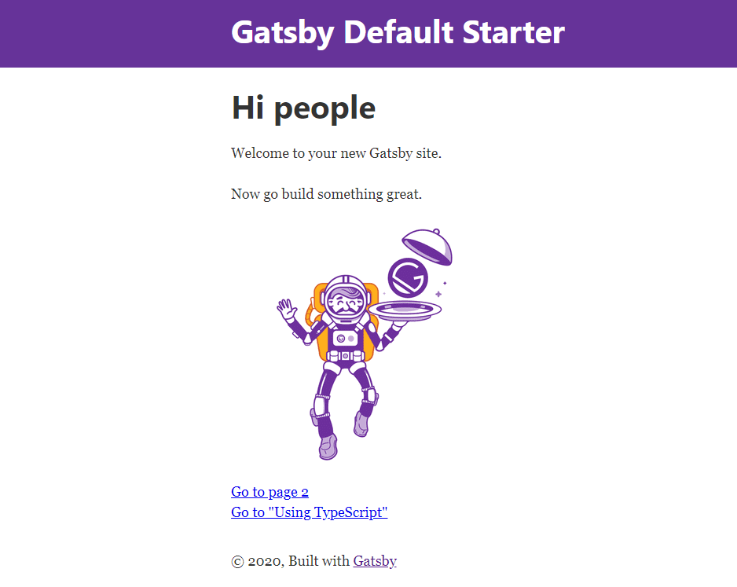
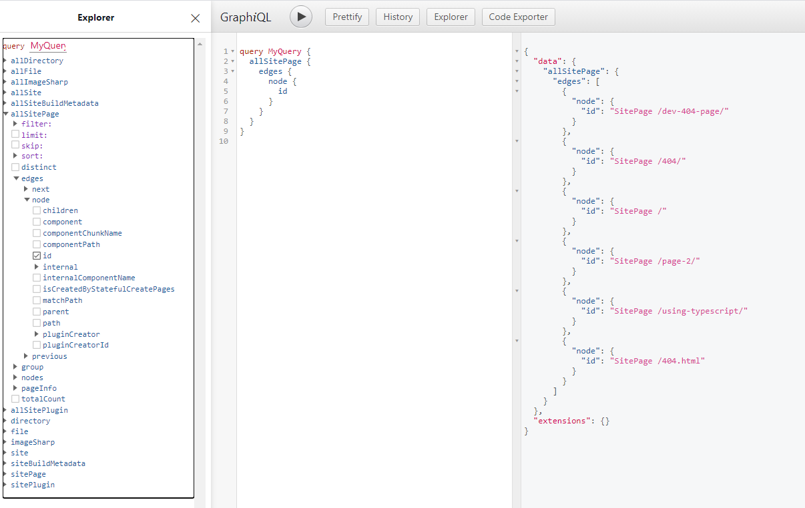

# 개요
이 포스팅에서는 Gatsby를 설치하고 GitHub에 적용하는 방법에 대해 소개하고자 합니다.  
이전에 [Jekyll로 홈페이지 만들기](/development/install-jekyll)를 작성했었는데, 이번에는 Gatsby로 홈페이지를 만들어 보겠습니다.

# Gatsby란 무엇인가?
Gatsby는 React 기반의 정적 사이트 생성기(SSG, Static Site Generator) 프레임워크 입니다. GraphQL을 통해 데이터를 관리하고, 빌드 시점에 HTML, CSS, Javascript를 생성합니다.  
Jekyll 과 같이 모든 페이지 정보들이 빌드 시점에 생성되므로 GitHub Pages를 통한 홈페이지 관리하기가 용이합니다.

# 왜 Jekyll에서 Gatsby로 바꿨나?
모두 아시다 싶이 Jekyll은 Ruby 기반이고, Gatsby는 React 기반으로 작성되어 있습니다. 우선, Ruby는 저에게 익숙하지 않았습니다.
모든 기술을 배우면 좋겠지만, Javascript가 익숙하고 NodeJS, Vue.js 등을 다뤄본 경험이 있던 저에게 React를 학습할 기회가 생겼습니다.
이때 우연히 Gatsby를 알게 되었고, 선택과 집중이 필요하다고 생각되어 React와 친해질 겸 Jekyll을 떠나 보내고, 먼지가 쌓인 블로그를 단장해보려 합니다.

# Gatsby를 사용해보자!
Gatsby를 설치하는 방법을 알아보고, 실행해보도록 하겠습니다.

## Gatsby 설치 및 실행
[Gatsby 시작](https://www.gatsbyjs.com/docs/quick-start)을 통해 Gatsby 설치 및 실행하는 방법을 볼 수 있습니다.
 
1. Gatsby CLI 설치
```bash
> npm intall -g gatsby-cli
```
Gatsby 설치는 npm 으로 `gatsby-cli`를 설치하며 시작됩니다.

2. Gatsby 프로젝트 생성
```bash
> gatsby new my-blog
```
별도로 프로젝트를 지정하지 않으면 [Gatsby 기본 스타터](https://github.com/gatsbyjs/gatsby-starter-default)를 기반으로 생성됩니다.

3. 생성된 프로젝트로 경로 이동
```bash
> cd my-blog
```

4. Gatsby 실행
```bash
> gatsby serve
```
위 명령어로 로컬에서 서비스를 실행시켜 볼 수 있으며, `> gatsby build`를 통해 빌드 결과물만 생성할 수도 있습니다.

## Gatsby 실행 결과물 살펴보기
위 명령어를 차례로 실하여 웹사이트 결과물과 GraphiQL 데이터 탐색 UI를 살펴보겠습니다.

### 웹사이트 화면
브라우저에서 [http://localhost:8000](http://localhost:8000) 접속을 통하여 웹사이트를 다음과 같이 볼 수 있습니다.

기본 사이트 구성은 메인 메뉴와 2개의 서브 메뉴로 구성되어 있는걸 볼 수 있습니다.

Gatsby의 장점중 하나는 자동으로 최적화를 지원해 준다는 점 입니다.  
크롬에서 개발자 모드를 열어놓고 확인해 보시면, 링크를 클릭하지 않더라도 링크에 마우스 오버시 필요한 파일을 미리 받아오며
이후 링크를 클릭할 때에는 기존에 미리 받아온 파일을 바로 보여주기 때문에 사용자는 빠른 반응성을 경험하게 됩니다.


### GraphiQL 탐색 화면
브라우저에서 [http://localhost:8000/___graphql](http://localhost:8000/___graphql) 접속을 통하여, 개발시 쉽게 데이터 탐색을 할 수 있습니다.
 
좌측의 트리 UI를 선택하여 조회할 데이터를 선택 후, 가운데 `Execute Query`버튼을 클릭하면, 우측에 결과 데이터가 보여지게 됩니다.


# Gatsby 구조를 살펴보자~
다음으로 생성한 Gatsby 소스 파일과 빌드된 파일의 내용을 비교하여 살펴보겠습니다.

## Gatsby 소스 파일 구조
```text
.
└─ .cache : Gatsby의 내부 캐시파일이 저장됩니다.
└─ node_modules : npm 의존성 모듈이 저장됩니다.
└─ public
└─ src
│ └─ components
│ └─ images
│ └─ pages
└─ gatsby-browser.js
└─ gatsby-config.js
└─ gatsby-node.js
└─ gatsby-ssr.js
.
.
.
```
- `.cache` : Gatsby의 내부 캐시파일이 저장됩니다.
- `node_modules` : npm 의존성 모듈이 저장됩니다.
- `public` : Gatsby의 빌드 결과물이 저장됩니다.
- `src` : Gatsby의 소스코드를 저장합니다.
- `src/components` : 모듈화된 기능의 컴포넌트를 저장합니다.
- `src/images` : 이미지 파일을 저장합니다.
- `src/pages` : pages 하위에 저장된 path에 따라 url이 생성됩니다.
- `gatsby-browser.js` : Gatsby 브라우저 API 사용 설정 파일입니다.
- `gatsby-config.js` : Gatsby의 기본 설정 파일입니다. 사이트의 세부정보 및 추가할 플러그인 정보를 저장합니다.
- `gatsby-node.js` : Gatsby node API 사용 설정 파일입니다.
- `gatsby-ssr.js` : Gatsby 서버 사이드 렌더링 API 사용 설정 파일입니다.

## 빌드된 파일 구조
아래와 같이 빌드된 파일 구조는 여러 파일로 나뉘어져 있습니다.  
이와 같이 여러 파일로 나뉘어지기 때문에 위에서 확인한 것과 같이, 최소한의 필요한 파일만 분리 호출하여 최적화가 가능합니다.
```text
.
└─ public
│ └─ 404
│ └─ icons
│ └─ page-2
│ └─ page-data
│ └─ static
│ └─ 404.html
│ └─ app-0f61b492ba0f76e7dbee.js
│ └─ app-0f61b492ba0f76e7dbee.js.LICENSE.txt
│ └─ app-0f61b492ba0f76e7dbee.js.map
│ └─ component---src-pages-page-2-js-6f9304e8e0b72f58449a.js
│ └─ component---src-pages-page-2-js-6f9304e8e0b72f58449a.js.map
│ └─ component---src-pages-using-typescript-tsx-d51a13ff025a3ef04cea.js
│ └─ component---src-pages-using-typescript-tsx-d51a13ff025a3ef04cea.js.map
.
.
.
```

# 줄이며...
지금까지 Gatsby가 무엇이고, SSG를 Jekyll에서 Gastby로 변경한 이유와 Gatsby의 장점에 대해 알아보았습니다.  
다음에는 GitHub Pages에 나만의 홈페이지를 생성하고, Travis CI를 통해 자동 배포하는 방법에 대해 알아보겠습니다.
