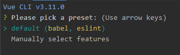

# Vue CLI란?
Vue CLI는 커멘드라인 인터페이스 기반의 Vue 프로젝트 생성 도구이며, 사용자가 어플리케이션 개발에 집중할 수 있도록 프로젝트 구성을 도와준다.

Vue CLI 3의 목표는 다음 두가지 [문제점](https://github.com/vuejs/vue-cli/issues/589)을 해결하는 것 이다.
1. 템플릿에 빌드 설정이 포함되어 다음의 문제가 존재한다.
  - 일단 프로젝트가 생성되면 템플릿의 의존성 업그레이드가 어렵다.
  - github에서 직접 가져오는 방식은 npm를 통한 버전관리에 취약하다.
  - 빌드 설정이 복잡하여 진입 장벽이 높다.
2. 선택 사항이 너무 많다.
  - 초보자가 어떤 템플릿이 현재 프로젝트에 적합한 템플릿인지 선택하기 어려우며, **webpack** 템플릿의 linter 또는 테스팅 도구는 진입 장벽이 높다.

# 일단 따라해보자!
Vue CLI를 통한 Vue 프로젝트를 생성해보자.

> 선행 작업으로 **node.js** 설치가 필요하다.  
> 필자가 사용한 node 버전은 v10.16.3 이다.

- Vue CLI 설치
**npm** 혹은 **yarn**을 설치 후 다음 명령어를 통해 Vuee CLI를 설치한다.
```
> npm install -g @vue/cli
# 혹은
> yarn global add @vue/cli
```

- Vue 프로젝트 생성 (CLI 사용)
프로젝트 명을 명시해서 생성할 수 있고, 혹은 현재 경로에 바로 생성할 수 있다.
```
> vue create my-project
# 혹은
> vue create .
```
위 명령어 실행 시, 기본값으로 자동 프로젝트 생성 혹은 사용자 정의 프로젝트 생성이 가능하다.  
기본값 생성으로는 **babel**과 **eslint**가 포함되어 있다.

사용자 정의 생성으로는 다음 항목들에 대해 선택이 가능하다.


- 디렉토리 구조
디렉토리 구조는 다음과 같이 구성되어 있다.


- Vue 프로젝트 생서 (GUI 사용)
다음 명령어를 통해 GUI를 사용하여 프로젝트를 생성할 수 있다.
```
> vue ui
```


# 끝으로...
여기까지 Vue CLI를 사용하여 기본 프로젝트를 생성하는 방법에 대해 알아보았다.  
다음에는 생성한 프로젝트의 구조에 대해 좀더 자세히 알아보도록 하자.
